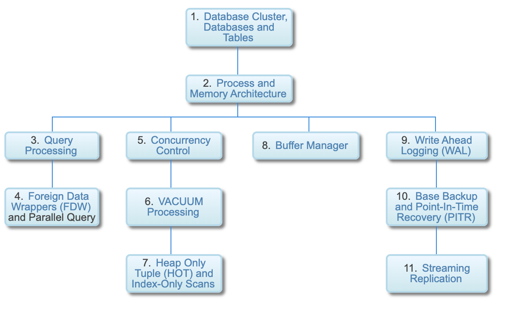

# PostgreSQL 内部机制
适用于PostgreSQL数据库管理员和系统开发人员
> :elephant: 本文翻译自 [Hironobu SUZUKI](http://www.interdb.jp/) 的经典系列博文 [The Internals of PostgreSQL](http://www.interdb.jp/pg/) 。

## 介绍
  本文档着笔于PostgreSQL内部机制剖析，面向数据库管理员和系统开发人员。

  PostgreSQL是一个开源的多用途的关系数据库系统，在世界范围内得到了广泛使用。这是一个集成多个子系统的庞大系统，每个子系统都具有特定的复杂功能并相互协作。对内部机制的理解，对于使用PostgreSQL进行管理和集成是至关重要的，但是它的庞大和复杂性却会阻碍理解过程。本文档的主要目的是：解释每个子系统的工作机制，并提供PostgreSQL的整体概况。

  本文档基于我在2012年用日语撰写的那本书（ISBN-13：978-4774153926）的第二部分，该书由七个部分组成，涵盖版本11及其更早的版本。

  本文档的[中文版本](https://item.jd.com/12527505.html)已于2019年5月出版。

## 内容
1. [Database Cluster, Databases and Tables](ch1.md)
2. [Process and Memory Architecture](ch2.md)
3. [Query Processing](ch3.md)
4. [Foreign Data Wrappers (FDW) and Parallel Query](ch4.md)
5. [Concurrency Control](ch5.md)
6. [VACUUM Processing](ch6.md)
7. [Heap Only Tuple (HOT) and Index-Only Scans](ch7.md)
8. [Buffer Manager](ch8.md)
9. [Write Ahead Logging (WAL)](ch9.md)
10. [Base Backup and Point-In-Time Recovery (PITR)](ch10.md)
11. [Streaming Replication](ch11.md)

## 导览图

## 变更历史
自2018年6月3日以来的变更历史记录如下：

日期           | 描述
------------  | -------- 
2019-03-27 | Added "Indexes Internals" in Section 1.4.2 and Section 3.2.2.3.
2018-12-15 | Fixed Section 3.3.2.1. Based on the cheapest access path obtained here, a query tree a plan tree is generated.
2018-10-10 | Improved Section 8.1.2.
2018-10-01 | Fixed Section 3.3.2.2.  (3) Create a path, estimate the cost of the sequential scan and add the path to the indexlist pathlist of the RelOptInfo.
2018-08-24 | Added Section 4.1.
2018-08-13 | Changed  in Section 9.7.
2018-08-13 | Added "How to Maintain AUTOVACUUM" in Section 6.5.
2018-08-03 | Added "Why the checkpointer was separated from the background writer?" in Section 8.6.
2018-06-03 | Updated for Version 11. Updated Section 6.1.1. Added "WAL segment file size" in Section 9.2. Added "Removal of prior checkpoint in PostgreSQL 11" in Section 9.7.2. Updated Section 9.9.2. Updated Section 10.1.1.

