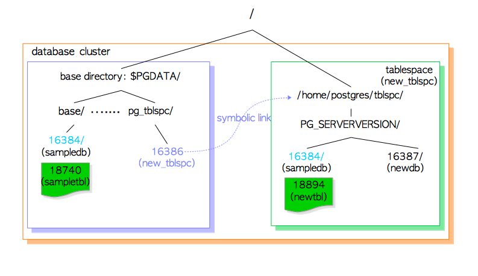

# 1 数据库集簇，数据库和表

本章以及下一章总结了 PostgreSQL 基础知识，以帮助阅读后续的章节。本章主要介绍以下主题：

- 数据库集群的逻辑结构
- 数据库集群的物理结构
- 堆表文件的内部布局
- 向表写入和读取数据的方法

如果您已经对这些内容很熟悉，则可以跳过本章。

## 1.1. 数据库集簇的逻辑

一个**数据库集簇(database cluster)**是指由一个PostgreSQL服务管理的一系列数据库的集合。如果你是初次听到此定义，你可能会感到疑惑，PostgreSQL中的”数据库集簇“**不表示**数据库服务的集合，而是运行在一个主机上的一个PostgreSQL服务，管理一个独立的数据库集簇。

图1.1 展示了一个数据库集簇的逻辑结构。*数据库*是*数据库对象*的集合。在关系数据库理论中，*数据库对象*是一种用于存储或引用数据的数据结构。 其中一个典型的例子是*（堆）表*，还有其他的，例如：索引、序列、视图、函数等等。在PostgreSQL中，数据库本身也是数据库对象，并且数据库之间在逻辑上相互独立。所有其他的数据库对象（比如：表、索引等）都属于相应的数据库。

**图 1.1. 一个数据库集簇的逻辑结构**


PostgreSQL中的所有数据库对象都由相应的**对象标识符（OID）**在内部进行管理，这些对象标识符是无符号的4字节整数。数据库对象及其对应的OID，根据对象的类型，存储在恰当的 [系统目录](http://www.postgresql.org/docs/current/static/catalogs.html) 中。例如：数据库的和堆表的OID分别存储在*pg_database和pg_class*中，因此你可以通过发出如下查询来查看他们的OID：

```sql-monosp
sampledb=# SELECT datname, oid FROM pg_database WHERE datname = 'sampledb';
 datname  |  oid  
----------+-------
 sampledb | 16384
(1 row)

sampledb=# SELECT relname, oid FROM pg_class WHERE relname = 'sampletbl';
  relname  |  oid  
-----------+-------
 sampletbl | 18740 
(1 row)
```

## 1.2. 数据库集簇的物理结构

一个*数据库集簇*本质上是一个目录，通常被称做**基础目录**，它包含一些子目录和许多文件。如果你执行[initdb](http://www.postgresql.org/docs/current/static/app-initdb.html)实用程序来初始化一个新的数据库集簇，则会在指定的目录下创建一个基础目录。虽然不是强制的，但基础目录的路径通常设置到环境变量*PGDATA*中。

图1.2 展示了一个PostgreSQL数据库集簇的示例。一个数据库是*base*子目录下的一个子目录，每个表和索引（至少）是一个存储在其所属数据库子目录下的文件。另外，还有几个包含特定数据和配置文件的子目录。尽管PostgreSQL支持*表空间*，但该术语的含义不同于其他RDBMS。PostgreSQL中表空间是一个目录，含有基础目录之外的一些数据。

**图 1.2. 一个数据库集簇的示例**


在下面几节中，将介绍PostgreSQL中的数据库集簇、数据库、与表和索引关联的数据库文件，以及表空间的布局。

### 1.2.1. 数据库集簇的布局

数据库集簇的布局已经在 [官方文档](http://www.postgresql.org/docs/current/static/storage-file-layout.html)中进行了介绍。在 表1.1 中列出了文档中的部分主要文件和字目录:

**表 1.1: 基础目录下的文件和子目录的布局  (摘自官方文档)**

| files                             | description                                                  |
| :-------------------------------- | :----------------------------------------------------------- |
| PG_VERSION                        | 包含PostgreSQL主要版本号的文件                               |
| pg_hba.conf                       | 用于控制PosgreSQL的客户端身份验证的文件                      |
| pg_ident.conf                     | 用于控制PostgreSQL用户名映射的文件                           |
| postgresql.conf                   | 用于设置参数的文件                                           |
| postgresql.auto.conf              | 用于存储设置在 ALTER SYSTEM (版本 9.4 及更高版本)中的配置参数的文件 |
| postmaster.opts                   | 记录服务器上次的启动的命令行选项的文件                       |
| subdirectories                    | description                                                  |
| base/                             | 包含每个数据库子目录的子目录。                               |
| global/                           | Subdirectory 包含集簇范围的的表，如pg_database 和 pg_control的子目录。 |
| pg_commit_ts/                     | 包含事务提交时间戳数据的子目录。版本9.5及更高版本。          |
| pg_clog/ (Version 9.6 or earlier) | 包含事物提交状态数据的子目录. 它在版本10中被重命名为 *pg_xact* 。 CLOG 将在 [小节5.4](http://www.interdb.jp/pg/pgsql05.html#_5.4.)中介绍。 |
| pg_dynshmem/                      | 包含动态共享内存子系统使用的文件的子目录。版本9.4及更高版本。 |
| pg_logical/                       | 包含用于逻辑解码的状态数据的子目录。版本 9.4 及更高版本。    |
| pg_multixact/                     | 包含多重事务状态数据的子目录（用于共享行锁）                 |
| pg_notify/                        | 包含 LISTEN/NOTIFY 状态数据的子目录。                        |
| pg_repslot/                       | 包含 [复制插槽](http://www.postgresql.org/docs/current/static/warm-standby.html#STREAMING-REPLICATION-SLOTS) 数据的子目录。版本 9.4 及更高版本。 |
| pg_serial/                        | 包含有关已提交的序列化事务的信息的子目录。 (版本 9.1及更高版本) |
| pg_snapshots/                     | 包含导出的快照的子目录 (版本 9.2 及更高版本)。PostgreSQL的函数pg_export_snapshot在此子目录中创建一个快照信息文件。 |
| pg_stat/                          | 包含统计子系统的永久文件的子目录。                           |
| pg_stat_tmp/                      | 包含统计子系统的临时文件的子目录。                           |
| pg_subtrans/                      | 包含子事务状态信息的子目录。                                 |
| pg_tblspc/                        | 包含指向表空间的符号链接的子目录。                           |
| pg_twophase/                      | Subdirectory containing state files for prepared transactions |
| pg_wal/ (Version 10 or later)     | 包含WAL（预写日志）段文件的子目录。在版本10中从原先的* pg_xlog *重命名而来。 |
| pg_xact/ (Version 10 or later)    | 包含事物提交状态数据的子目录。从版本10的*pg_clog* 重命名而来。CLOG 将在 [小结 5.4](http://www.interdb.jp/pg/pgsql05.html#_5.4.)进行介绍。 |
| pg_xlog/ (Version 9.6 or earlier) | 包含WAL（预写日志）段文件的子目录。在版本10中将其重命名为* pg_wal *。 |

### 1.2.2. 数据库的布局

一个数据库是*base*子目录下的一个子目录；数据库目录的名字与其OID相同。例如，当数据库*sampledb*的OID是16384，那么它的子目录名称是16384。

```
$ cd $PGDATA
$ ls -ld base/16384
drwx------  213 postgres postgres  7242  8 26 16:33 16384
```

### 1.2.3. 与表和索引关联的文件的布局

每个小于1GB的表或索引都是一个独立的文件，存储在其所属数据库的目录下。表和索引作为数据库对象在内部通过独立的OID管理，而这些数据文件由变量*relfilenode*管理。表和索引的relfilenode值，基本上但并不总是匹配各自的OID，详细说明如下。

让我们查看一下表*sampletbl*的OID和relfilenode：

```sql-monosp
sampledb=# SELECT relname, oid, relfilenode FROM pg_class WHERE relname = 'sampletbl';
  relname  |  oid  | relfilenode
-----------+-------+-------------
 sampletbl | 18740 |       18740 
(1 row)
```

从上面的结果，你可以看到oid和relfilenode的值是相等的。你还可以看到表*sampletbl*的数据文件的路径是*'base/16384/18740'*。

```
$ cd $PGDATA
$ ls -la base/16384/18740
-rw------- 1 postgres postgres 8192 Apr 21 10:21 base/16384/18740
```

表和索引的relfilenode值可以通过发出一些命令（例如：TRUNCATE，REINDEX，CLUSTER）进行更改。例如，如果我们截断表*sampletbl*，PostgreSQL将为该表分配一个新的relfilenode（18812），删除旧的数据文件（18740），并创建一个新的relfilenode（18812）。

```sql-monosp
sampledb=# TRUNCATE sampletbl;
TRUNCATE TABLE

sampledb=# SELECT relname, oid, relfilenode FROM pg_class WHERE relname = 'sampletbl';
  relname  |  oid  | relfilenode
-----------+-------+-------------
 sampletbl | 18740 |       18812 
(1 row)
```

在9.0或更高版本中，内置函数 *pg_relation_filepath* 是很有用的，因为该函数通过指定的OID或名称，返回该关系的文件路径名。

```sql-monosp
sampledb=# SELECT pg_relation_filepath('sampletbl');
 pg_relation_filepath 
----------------------
 base/16384/18812
(1 row)
```

当表和索引的文件大小超过1GB时，PostgreSQL将创建一个名为relfilenode.1的新文件并使用它。如果新文件已填满，将创建下一个名为relfilenode.2的新文件，依此类推。

```
$ cd $PGDATA
$ ls -la -h base/16384/19427*
-rw------- 1 postgres postgres 1.0G  Apr  21 11:16 data/base/16384/19427
-rw------- 1 postgres postgres  45M  Apr  21 11:20 data/base/16384/19427.1
...
```

在构建PostgreSQL时，可以使用配置选项--with-segsize更改表和索引的最大文件大小。

仔细查看数据库子目录，您会发现每个表都有两个关联文件，分别以“ *fsm*”和“ *vm*”为后缀。它们分别称为**空闲空间映射（free space map）** 和 **可见性映射（visibility map）**，分别在表文件中的每一页上存储可用空间容量和可见性的信息 (详情请参阅 [第5.3.4节](http://www.interdb.jp/pg/pgsql05.html#5.3.4.) 和 [第6.2节](http://www.interdb.jp/pg/pgsql06.html#_6.2.) ）。索引仅具有单独的free space maps，而没有visibility map。

一个具体示例如下：

```
$ cd $PGDATA
$ ls -la base/16384/18751*
-rw------- 1 postgres postgres  8192 Apr 21 10:21 base/16384/18751
-rw------- 1 postgres postgres 24576 Apr 21 10:18 base/16384/18751_fsm
-rw------- 1 postgres postgres  8192 Apr 21 10:18 base/16384/18751_vm
```

它们在内部也可以称为每个关系的**forks**；free space map是表/索引数据文件的第一个fork（fork编号为1），visibility map是表的数据文件的第二个fork（fork编号为2）。数据文件的fork编号为0。

### 1.2.4. 表空间

PostgreSQL中的*表空间（tablespace）*是基础目录之外的额外数据区域。此功能已在8.0版中实现。

图1.3 展示了一个表空间的内部布局，及其与主数据区域的关系。

**图 1.3. 数据库集簇中的一个表空间**



一个表空间创建的位置是在发出 [CREATE TABLESPACE](http://www.postgresql.org/docs/current/static/sql-createtablespace.html) 语句时指定的路径。并且，在那个路径下，特定版本的子路径 (例如： PG_9.4_201409291) 会被创建。 特定版本的子目录的命名方法如下所示。

```
PG _ 'Major version' _ 'Catalogue version number'
```

例如， 如果你在 *'/home/postgres/tblspc'* 创建一个表空间 *'new_tblspc'* ，其oid为16386， 则会在该表空间下创建一个子目录，例如*'PG_9.4_201409291'*。

```
$ ls -l /home/postgres/tblspc/
total 4
drwx------ 2 postgres postgres 4096 Apr 21 10:08 PG_9.4_201409291
```

该表空间目录由来自*pg_tblspc*子目录的符号链接来寻址，且链接名称与表空间的OID值相同。

```
$ ls -l $PGDATA/pg_tblspc/
total 0
lrwxrwxrwx 1 postgres postgres 21 Apr 21 10:08 16386 -> /home/postgres/tblspc
```

如果你在tablespace下创建了一个新的数据库 (OID 为 16387) ，那么它的目录会被创建在特定版本子目录下。 

```
$ ls -l /home/postgres/tblspc/PG_9.4_201409291/
total 4
drwx------ 2 postgres postgres 4096 Apr 21 10:10 16387
```

如果你创建一个新的表，该表所属于在base目录下创建的数据库：首先，新目录的名称与现有数据库OID相同，创建到特定版本子目录下；然后，将新的表文件放入创建的目录下。 

```sql-monosp
sampledb=# CREATE TABLE newtbl (.....) TABLESPACE new_tblspc;

sampledb=# SELECT pg_relation_filepath('newtbl');
             pg_relation_filepath             
----------------------------------------------
 pg_tblspc/16386/PG_9.4_201409291/16384/18894
```

## 1.3. 一个堆表文件的内部布局

在数据文件（堆表和索引，以及free space map和visibility map）内部，该文件分为固定长度的**页（pages）**（或**块（blocks）**），默认为8192字节（8 KB）。每个文件中的那些页从0开始按顺序编号，这些编号称为**块编号（block numbers）**。如果文件已填满，PostgreSQL将在文件末尾添加一个新的空白页以增加文件大小。

页的内部布局取决于数据文件的类型。在本节中，将介绍表的布局，因为后边章节将需要这些信息。

**图 1.4. 一个堆表文件的页的布局**


一个表中的一个页包含三种数据，描述如下:

1. **堆元组heap tuple(s)** – 堆元组本身就是记录数据。它们从页面底部开始按顺序堆叠。元组的内部结构在 [小节 5.2](http://www.interdb.jp/pg/pgsql05.html#_5.2.) and [第 9 章](http://www.interdb.jp/pg/pgsql09.html) 介绍，同时需要了解PostgreSQL中的并发控制(CC) 和 WAL的知识。

2. **行指针line pointer(s)** – 一个行指针的长度为4字节，并包含指向每个堆元组的指针。它也被称为**项指针（item pointer）**.
   多个行指针组成一个简单的数组，该数组起着元组的索引的作用。每个索引从1开始依次编号，称为**偏移量（offset number） **。当将1个新的元组添加到页时，一个新的行指针也被推到数组上以指向新的元组。

3. **头数据header data** – 由[PageHeaderData](javascript:void(0)) 定义的头数据位于页的开头。它的长度是24字节，包含有关于页的常规信息。结构的主要变量描述如下。

4. - *pd_lsn* – 该变量存储由该页面的最后更改写入的XLOG记录的LSN 。它是一个8字节无符号整型，与 WAL (Write-Ahead Logging) 机制有关。详情在 [第 9 章](http://www.interdb.jp/pg/pgsql09.html#_9.1.2.)进行介绍。
   - *pd_checksum* – 该变量存储该页的校验和值（checksum value）。（请注意，此变量仅在版本9.3或更高版本中支持；在较早的版本中，此部分已经存储了页的timelineId。）
   - *pd_lower, pd_upper* – pd_lower指向行指针的末尾，而pd_upper指向最新堆元组的开头。 
   - *pd_special* – 此变量用于索引。在表的页中，它指向页面的末尾。 （在索引的页中，它指向特殊空间的开头，该空间是仅由索引保存的数据区域，并根据诸如B树，GiST，GiN等类型的索引类型包含特定数据。）

行指针的末尾和最新元组的开头之间的空白空间被称作 **free space** 或者 **hole**.

为了标识表中的元组，内部使用了**元组标识符（TID）**。 一个TID包含一对值：包含元组的页的*块号block number*和指向元组的行指针的*偏移量（offset number）*。其用法的一个典型例子是索引。详情参见 [小结 1.4.2](http://www.interdb.jp/pg/pgsql01.html#_1.4.2.).

结构体PageHeaderData定义在 [src/include/storage/bufpage.h](https://github.com/postgres/postgres/blob/master/src/include/storage/bufpage.h)中。

此外，大小超过2 KB (约为8 KB的 1/4 )的堆元组，是通过一个称作 **TOAST** (The Oversized-Attribute Storage Technique)的方法来管理和存储的。详情请参阅PostgreSQL 官网文档](http://www.postgresql.org/docs/current/static/storage-toast.html) 。

## 1.4. 写和读元组（tuples）的方法

本章的最后，介绍编写和读取堆元组（heap tuples）的方法。

### 1.4.1. 写堆元组

假设1个表由1个页组成，其中仅包含1个堆元组。此页的pd_lower指向第1个行指针，并且行指针和pd_upper都指向第一个堆元组。参见 图 1.5（a）。

当插入第2个元组时，它被放置在第1个元组之后。第2个行指针被推到第1个，它指向第2个元组。 pd_lower变为指向第2个行指针，而pd_upper变为指向第2堆元组。参见 图1.5（b）。此页中的其他头部数据（例如pd_lsn，pg_checksum，pg_flag）也被重写为适当的值；在 [小节 5.3](http://www.interdb.jp/pg/pgsql05.html#_5.3.) 和 [小节 9](http://www.interdb.jp/pg/pgsql09.html)描述了更多详细信息。

**图 1.5. 一个堆元组的写入**


### 1.4.2. 读堆元组

两种典型的访问方法 - 顺序扫描（sequential scan）和B树索引扫描（B-tree index scan），描述如下：

- **顺序扫描** – 通过扫描每一页中的所有行指针，顺序读取所有页中的所有元组。参见 图1.6（a）。
- **B树索引扫描** – 一个索引文件包含多个索引元组，每个索引元组都由索引键和指向目标堆元组的TID组成。如果找到了具有您要查找的键的索引元组，则PostgreSQL使用获得的TID值读取所需的堆元组。（这里不解释在B树索引中查找索引元组的方法的描述，因为它很常见，并且这里的空间有限。请自行参考相关材料。）例如，在 图1.6（b）中，获得的索引元组的TID值是“（block= 7，Offset= 2）”。这意味着目标堆元组是表中第7页中的第2个元组，因此PostgreSQL可以读取所需的堆元组，而无需在页面中进行不必要的扫描。

**图 1.6. 顺序扫描和索引扫描**


> **内部索引**
>
> 本文档未详细介绍索引。要了解它们，建议阅读以下所示的很有用的文章：
>
> - [ PostgreSQL中的索引 — 1](https://postgrespro.com/blog/pgsql/3994098)
> - [PostgreSQL中的索引 — 2](https://postgrespro.com/blog/pgsql/4161264)
> - [PostgreSQL中的索引 — 3 (Hash)](https://postgrespro.com/blog/pgsql/4161321)
> - [PostgreSQL中的索引 — 4 (Btree)](https://postgrespro.com/blog/pgsql/4161516)
> - [PostgreSQL中的索引 — 5 (GiST)](https://postgrespro.com/blog/pgsql/4175817)
> - [PostgreSQL中的索引 — 6 (SP-GiST)](https://habr.com/en/company/postgrespro/blog/446624/)
> - [PostgreSQL中的索引 — 7 (GIN)](https://habr.com/en/company/postgrespro/blog/448746/)
> - [PostgreSQL — 9 (BRIN)](https://habr.com/en/company/postgrespro/blog/452900/)


> **提示**
>
> PostgreSQL也支持 TID-Scan、[Bitmap-Scan](https://wiki.postgresql.org/wiki/Bitmap_Indexes) 和 Index-Only-Scan。
>
> TID-Scan是一种通过使用所需元组的TID直接访问元组的方法。例如，要在表的第0页中找到第1个元组，请发出以下查询：
>
> ```
> sampledb=# SELECT ctid, data FROM sampletbl WHERE ctid = '(0,1)';
>  ctid  |   data    
> -------+-----------
>  (0,1) | AAAAAAAAA
> (1 row)
> ```
>
> Index-Only-Scan 将会在 [第 7 章](http://www.interdb.jp/pg/pgsql07.html)详细介绍。


