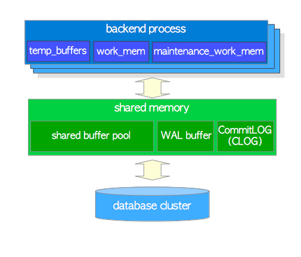

# 2  进程和内存架构

在本章中，对PostgreSQL中的进程架构和内存体系结构进行了总结，以帮助阅读后续章节。如果您已经熟悉这些内容，则可以跳过本章。

## 2.1. 进程架构

PostgreSQL是一个客户端/服务器类型的关系型数据库管理系统，具有多进程架构并且可在单机上运行。

协同管理一个数据库集簇的多个进程的集合，通常称作一个*'PostgreSQL 服务'*，它包含以下类型的进程：

- **postgres服务进程（postgres server process）** 是与数据库集簇管理相关的所有进程的父进程。
- 每个 **后端进程（backend process）** 处理由连接的客户端发出的所有查询和语句。
- 各种 **后台进程（background processes）** 执行各自功能的进程 (例如：VACUUM 和 CHECKPOINT 进程) 以进行数据库管理。
-  **复制相关进程（replication associated processes）** 中，执行流复制。 详细内容在 [第11章](http://www.interdb.jp/pg/pgsql11.html)进行介绍。
- 在自版本9.3开始支持的 **后台工作进程（background worker process）** 中，它可以执行用户实现的任何处理。此处不再赘述，请参考 [官方文档](http://www.postgresql.org/docs/current/static/bgworker.html)。

在以下小节中，将详细介绍前三种类型的进程。

**图 2.1. PostgreSQL中进程架构的示例**


该图展示了一个PostgreSQL服务的所有进程：1个postgres server进程，2个backend processes，7个background processes和2个client processes。还展示了database cluster、shared memory和2个client processes 。

### 2.1.1. Postgres Server Process

如上所述，*postgres server process*是PostgreSQL服务中所有进程的父进程。在早期版本中，它被称为“postmaster”。

通过执行[pg_ctl](http://www.postgresql.org/docs/current/static/app-pg-ctl.html) 实用程序的*start* 选项, 会启动一个 postgres server process。然后，它在内存中分配一个共享内存区域，启动各种后台进程，必要时启动eplication associated processes和background worker processes，并等待来自客户端的连接请求。每当接收到来自客户端的连接请求时，它就会启动一个backend process。 （然后，启动的backend process处理由连接的客户端发出的所有查询。）

一个 postgres server process 监听一个网络端口，默认端口号是5432。虽然可以在同一主机上运行多个PostgreSQL server，但应该将每个服务器设置为监听不同的端口号，例如5432、5433等。

### 2.1.2. Backend Processes

一个 backend process，也被称作 *postgres*，由 postgres server process 启动，并处理由一个连接的客户端发出的所有查询。它通过单个TCP连接与客户端通信，并在客户端断开连接时终止。

由于一次只允许操作一个数据库，因此当连接一个PostgreSQL server时需要显式地指定一个要使用的数据库。

PostgreSQL 允许多个客户端同时连接；配置参数 *[max_connections](http://www.postgresql.org/docs/current/static/runtime-config-connection.html#GUC-MAX-CONNECTIONS)* 控制客户端的最大数量 (默认为100)。

如果许多客户端（例如WEB应用程序）经常与PostgreSQL server进行重复连接和断开连接，则这会增加建立连接和创建backend processes的成本，因为PostgreSQL尚未实现本机连接池功能。这种情况会对数据库服务器的性能产生负面影响。为了解决这种情况 ，通常实用池化中间件 ( [pgbouncer](https://pgbouncer.github.io/) 或者 [pgpool-II](http://www.pgpool.net/mediawiki/index.php/Main_Page)) 。

### 2.1.3. Background Processes

表 2.1 展示了 background processes 的列表。与 postgres server 和 backend process相比，不可能简单地解释每个功能，因为这些功能依赖于独立的指定功能和PostgreSQL内部机制。因此，本章仅作介绍。详细内容将在以下一章中介绍。

**表 2.1: background processes**

| process                    | description                                                  | reference                                                    |
| :------------------------- | :----------------------------------------------------------- | :----------------------------------------------------------- |
| background writer          | 在该进程中，共享缓冲池上的脏页会定期有规律地逐渐写入持久性存储（例如HDD，SSD）。 （在9.1或更早版本中，它还负责检查点进程。） | [小节 8.6](http://www.interdb.jp/pg/pgsql08.html#_8.6.)      |
| checkpointer               | 在9.2或更高版本中，在该进程中执行检查点进程。                | [小节 8.6](http://www.interdb.jp/pg/pgsql08.html#_8.6.), [小节 9.7](http://www.interdb.jp/pg/pgsql09.html#_9.7.) |
| autovacuum launcher        | autovacuum-worker processes 会被定期触发用于vacuum process 。 (更确切的说，它请求为 postgres server 创建 autovacuum workers 。) | [小节 6.5](http://www.interdb.jp/pg/pgsql06.html#_6.5.)      |
| WAL writer                 | 该进程定期将WAL缓冲区上的WAL数据写入并刷到持久性存储中。     | [小节 9.9](http://www.interdb.jp/pg/pgsql09.html#_9.9.)      |
| statistics collector       | 在该进程中，将为诸如 pg_stat_activity 和pg_stat_database 收集统计信息。 |                                                              |
| logging collector (logger) | 该进程将错误信息写入日志文件。                               |                                                              |
| archiver                   | 该进程中执行归档日志记录归档 。                              | [小节 9.10](http://www.interdb.jp/pg/pgsql09.html#_9.10.)    |

> 此处展示了一个PostgreSQL server的实际进程情况。在下面的示例中，1个 postgres server process（pid为9687），2个backend processes（pid为9697和9717）以及 表2.1 中列出的几个background processes正在运行。另请参阅 图2.1。
>
> ```sql
> postgres> pstree -p 9687
> -+= 00001 root /sbin/launchd
>  \-+- 09687 postgres /usr/local/pgsql/bin/postgres -D /usr/local/pgsql/data
>    |--= 09688 postgres postgres: logger process     
>    |--= 09690 postgres postgres: checkpointer process     
>    |--= 09691 postgres postgres: writer process     
>    |--= 09692 postgres postgres: wal writer process     
>    |--= 09693 postgres postgres: autovacuum launcher process     
>    |--= 09694 postgres postgres: archiver process     
>    |--= 09695 postgres postgres: stats collector process     
>    |--= 09697 postgres postgres: postgres sampledb 192.168.1.100(54924) idle  
>    \--= 09717 postgres postgres: postgres sampledb 192.168.1.100(54964) idle in transaction  
> ```

## 2.2. 内存架构

 PostgreSQL 中的内存架构可以分为两大类：

- 本地内存区 – 由每个 backend process 自己分配以供其自己使用。
- 共享内存区域 – 由PostgreSQL server的所有进程使用。

在以下小节中，将简要介绍这些内容。

**图 2.2.  PostgreSQL中的内存架构**



### 2.2.1. 本地内存区域

每个backend process分配一个本地内存区用于查询处理；每个区域都分为几个子区域 - 它们的大小可以是固定的也可以是可变的。表2.2列出了主要的子区域。详细内容将在以下章节中介绍。

| sub-area             | description                                                  | reference                                               |
| :------------------- | :----------------------------------------------------------- | :------------------------------------------------------ |
| work_mem             | 执行器使用此区域：通过ORDER BY和DISTINCT操作对元组进行排序，并通过merge-join和hash-join操作进行表连接。 | [第 3 章](http://www.interdb.jp/pg/pgsql03.html)        |
| maintenance_work_mem | 某些维护操作 (如： VACUUM、 REINDEX) 使用该区域。            | [小节 6.1](http://www.interdb.jp/pg/pgsql06.html#_6.1.) |
| temp_buffers         | Executor uses this area for storing temporary tables.        |                                                         |

### 2.2.2. 共享内存区域

PostgreSQL服务器启动时将分配一个共享内存区域。此区域也分为几个固定大小的子区域。表 2.3 列出了主要子区域。详细内容将在以下章节中介绍。

| sub-area           | description                                                  | reference                                               |
| :----------------- | :----------------------------------------------------------- | :------------------------------------------------------ |
| shared buffer pool | PostgreSQL将表和索引中的页从持久性存储加载到此处，并直接对其进行操作。 | [第 8 章](http://www.interdb.jp/pg/pgsql08.html)        |
| WAL buffer         | 为了确保服务器故障不会丢失任何数据，PostgreSQL支持WAL机制。 WAL数据（也称为XLOG记录）是PostgreSQL中的事务日志； WAL缓冲区是WAL数据在写入持久性存储之前的缓冲区。 | [第 9 章](http://www.interdb.jp/pg/pgsql09.html)        |
| commit log         | Commit Log(CLOG) 保持所有事务的状态 (例如：in_progress、committed、aborted) 用于 Concurrency Control (CC) 机制。 | [小节 5.4](http://www.interdb.jp/pg/pgsql05.html#_5.4.) |

除了这些，PostgreSQL还分配了几个区域，比如下面的：

- 用于各种访问控制机制的子区域。(例如：semaphores, lightweight locks, shared 和 exclusive locks等)
- 用于各种background processes的子区域，例如checkpointer 和 autovacuum。
- 用于事务处理的子区域，例如保存点（save-point ）和两阶段提交（ two-phase-commit）。

以及其他的区域。