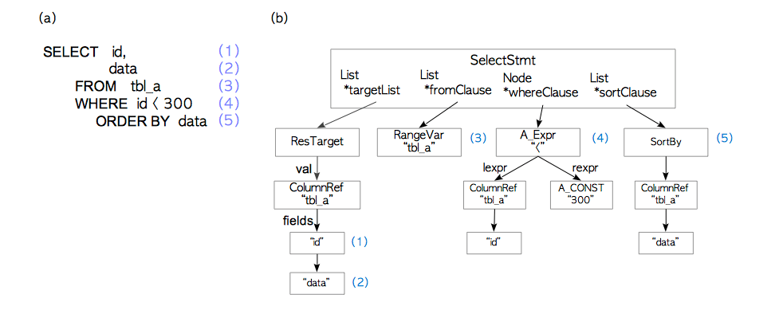
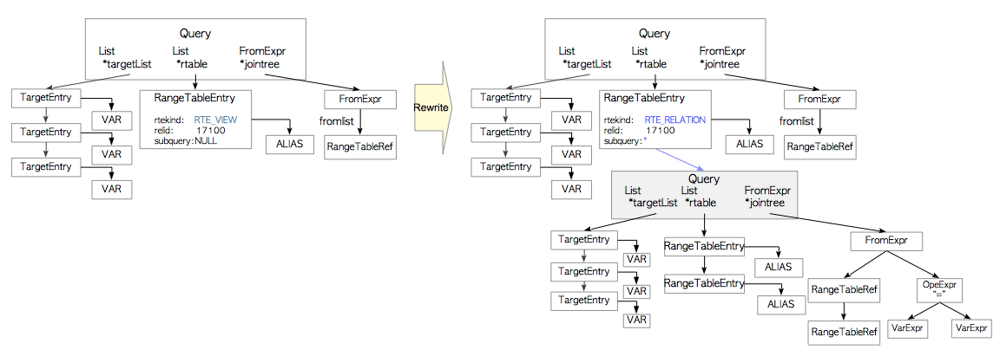
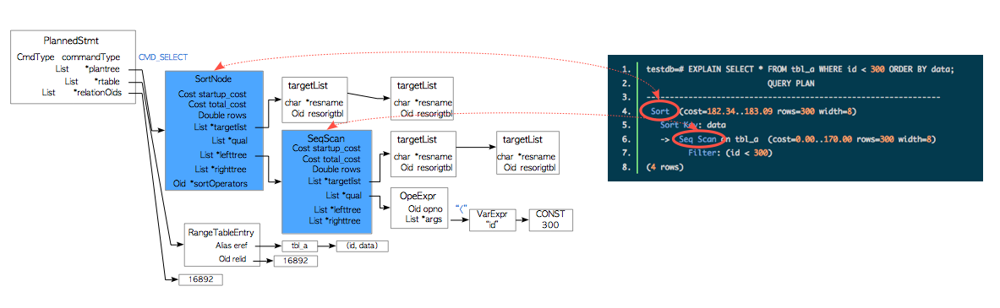

# 3  查询处理

正如 [官方文档](https://www.postgresql.org/docs/current/static/features.html) 所述，PostgreSQL支持大量2011年SQL标准所要求的特性。查询处理是PostgreSQL中最复杂的子系统，它可以有效地处理受支持的SQL。本章概述了查询处理；尤其是，专注于查询优化。

本章包括以下三个部分：

- **第 1 部分:** 小节 3.1.
- 本节概述了PostgreSQL中的查询处理。

- **第 2 部分:** 小节 3.2. — 3.4.
- 本部分说明了获取单表查询最佳计划的需要遵循的步骤。在第3.2节和第3.3节中，分别说明了估算成本和创建计划树的过程。在第3.4节中，简要描述了执行器的操作。

- **第 3 部分:** 小节 3.5. — 3.6.
- 本部分说明获取多表查询的最佳计划的过程。在第3.5节中，描述了三种联接方法：嵌套循环，合并和哈希联接。在第3.6节中，说明了创建多表查询的计划树的过程。

PostgreSQL 支持三种技术上有趣且实用的功能，即 [外部数据封装器 (FDW)](http://www.postgresql.org/docs/current/static/fdwhandler.html), [并行查询](https://www.postgresql.org/docs/current/static/parallel-query.html) 和 [即时（JIT）编译](https://www.postgresql.org/docs/11/static/jit-reason.html) ，自版本11开始支持。 其中前两个将在 [第 4 章](http://www.interdb.jp/pg/pgsql04.html) 进行介绍。 JIT 编译超出了本文档的范围；详情请参阅 [官方文档](https://www.postgresql.org/docs/11/static/jit-reason.html) 。

## 3.1. 综述

在PostgreSQL中， 尽管在版本9.6中实现的并行查询使用了多个后台工作进程，但后端进程基本上可以处理由连接的客户端发出的所有查询。该后端包含五个子系统，如下所示：

1. 解析器（Parser）
2. 解析器对纯文本格式的SQL语句解析生成一棵解析树。

3. 分析器（Analyzer/Analyser）
4. 分析器对解析树进行语义分析生成一棵查询树。

5. 重写器（Rewriter）
6. 如果存储在[规则系统](http://www.postgresql.org/docs/current/static/rules.html)中的规则存在，重写器会使用这些规则来转换查询树。

7. 计划器（Planner）
8. 计划器生成计划树，计划树可以在查询树得到最有效的执行。

9. 执行器（Executor）
10. 执行器通过按计划树创建的顺序访问表和索引，来执行查询。

**图 3.1. 查询处理**


在本节中，提供了这些子系统的概述。由于计划器和执行器非常复杂，因此接下来几节将对这些功能进行详细说明。

PostgreSQL 的查询处理在[官方文档](http://www.postgresql.org/docs/current/static/overview.html)有详细的介绍。

### 3.1.1. 解析器

解析器将一条纯文本的SQL语句生成一棵解析树，使得后边的子系统可以读取。下面展示了一个具体的例子，但没有详细介绍。

让我们思考下面显示的查询。

```sql-monosp
testdb=# SELECT id, data FROM tbl_a WHERE id < 300 ORDER BY data;
```

一棵解析树就是一棵根节点为[SelectStmt](javascript:void(0)) 结构（定义在[parsenodes.h](https://github.com/postgres/postgres/blob/master/src/include/nodes/parsenodes.h)）的树。图 3.2(a)中查询对应的解析树是图 3.2(b) 。

**图 3.2. 一棵解析树的示例**



给SELECT查询中的元素与其对应的解析树中的元素编相同的号。例如，（1）是第一个目标列中的一项同时它是表的字段”id“，（4）是一个WHERE子句，依此类推。

由于解析器仅在生成解析树时检查输入内容的语法，因此，仅在查询中出现语法错误时才返回错误。

解析器不检查所输入查询的语义。例如，即使查询中包含一个不存在的表名，解析器也不会返回错误。语义检查由分析器来完成。

### 3.1.2. 分析器

分析器对解析器生成的解析树执行语义分析，生成一棵查询树。

一棵查询树的根节点是[Query](javascript:void(0))结构（定义在[parsenodes.h](https://github.com/postgres/postgres/blob/master/src/include/nodes/parsenodes.h)中）；该结构包含其相应查询的元数据，诸如命令的类型（SELECT,INSERT或其他）和几个叶子结点；每个叶子结点生成一个列表或者一棵树，并且持有单个特定子句的数据。

图 3.3 展示了前面小节的图 3.2(a) 中的查询语句对应的查询树

**图 3.3. 一棵查询树的示例**


上述查询树简单介绍如下。

- The targetlist is a list of columns that are the result of this query. In this example, this list is composed of two columns: *‘id'* and *‘data’*. If the input query tree uses ‘**\(\ast\)**' (asterisk), the analyzer/analyser will explicitly replace it to all of the columns.
- The range table is a list of relations that are used in this query. In this example, this table holds the information of the table ‘*tbl_a*’ such as the *oid* of this table and the name of this table.
- The join tree stores the FROM clause and the WHERE clauses.
- The sort clause is a list of SortGroupClause.

查询树的详细信息请参考 [官方文档](http://www.postgresql.org/docs/current/static/querytree.html) 。

### 3.1.3. 重写器

重写器是实现[规则系统](http://www.postgresql.org/docs/current/static/rules.html)的系统，必要时，根据存储在[pg_rules](http://www.postgresql.org/docs/current/static/view-pg-rules.html)系统目录中的规则来转换一棵查询树。规则系统本身就是一个有趣的系统，但是，为了避免本章内容过长，就省略了规则系统和重写器的介绍。

> *视图*
>
> 在PostgreSQL中[视图（Views）](https://www.postgresql.org/docs/current/static/rules-views.html) 是使用系统规则来实现的。 当一个视图通过[CREATE VIEW](http://www.postgresql.org/docs/current/static/sql-createview.html)命令定义，会自动生成相应的规则并存储在  catalog中。
>
> 假设以下视图已定义，相应的规则存储在*pg_rules*系统目录中。

```sql-monosp
sampledb=# CREATE VIEW employees_list 
sampledb-#      AS SELECT e.id, e.name, d.name AS department 
sampledb-#            FROM employees AS e, departments AS d WHERE e.department_id = d.id;
```

> 如下所示，当包含视图当查询发出时，解析器会创建 图 3.4(a) 所示解析树。

```sql-monosp
sampledb=# SELECT * FROM employees_list;
```

> 在此阶段，重写器将范围表结点（range table node）处理成子查询的一棵解析树中，即为存储在*pg_rules*中的相应的视图。

**图 3.4. 重写器阶段的示例**



> 由于 PostgreSQL 使用此机制实现视图，因此在版本9.2之前视图时无法更新的。因此，从版本 9.3 开始视图便可以更新；但是，在更新视图方面有很多限制。这些详细内容请参阅 [官方文档](https://www.postgresql.org/docs/current/static/sql-createview.html#SQL-CREATEVIEW-UPDATABLE-VIEWS)。

### 3.1.4. 计划器和执行器

计划器从重写器那些接收到一棵查询树，并生成一棵（查询）计划树，该计划树可供执行器最有效的处理。

PostgreSQL中的计划器是根据存粹基于成本优化；不支持基于规则优化和提示。此计划器时RDBMS宗最复杂的子系统；因此，本章后续小节将概述计划器。

> **pg_hint_plan**
>
> PostgreSQL 不支持在 SQL 中的计划器提示，并且永远不会支持该特性。如果要在查询中使用提示，涉及*pg_hint_plan*的扩展值得考虑。详情参考 [官方网站](http://pghintplan.osdn.jp/pg_hint_plan.html) 。

与其他 RDBMS 一样，PostgreSQL中的 [EXPLAIN](http://www.postgresql.org/docs/current/static/sql-explain.html) 命令显示计划树本身。具体示例如下所示。

```sql-monosp
testdb=# EXPLAIN SELECT * FROM tbl_a WHERE id < 300 ORDER BY data;
                          QUERY PLAN                           
---------------------------------------------------------------
 Sort  (cost=182.34..183.09 rows=300 width=8)
   Sort Key: data
   ->  Seq Scan on tbl_a  (cost=0.00..170.00 rows=300 width=8)
         Filter: (id < 300)
(4 rows)
```

该结果展示了图 3.5 所示的计划树。

**图 3.5. 一棵简单的计划树 和 计划树与EXPLAIN命令的结果 之间的关系**



一棵计划树由称作 *plan nodes* 的元素组成，并且它连接到*PlannedStmt*结构的 plantree 列表中。 这些元素定义在 [plannodes.h](https://github.com/postgres/postgres/blob/master/src/include/nodes/plannodes.h)。详细内容将在小节 3.3.3 (和小节 3.5.4.2)介绍。

每个计划结点拥有执行器需要用于处理的信息，对于单表查询的情况，执行器从计划树的末尾到根结点进行处理。

例如，图 3.5 中展示的计划树是排序节点和顺序扫描节点的列表；因此，执行器通过顺序扫描来扫描表：*tbl_a*，然后对获得的结果进行排序。

执行器通过缓存管理器（在[第8章](http://www.interdb.jp/pg/pgsql08.html)介绍）  读和写数据库集群中的表和索引。当处理一个查询时，执行器使用一些内存区域，诸如temp_buffers 和 work_mem，这些内存区域提前分配，并在必要时创建临时文件。

除此之外，当访问元组（tuples）时，PostgreSQL使用并发控制机制，来维护当前运行事务的一致性和隔离性。并发控制机制在[第5章](http://www.interdb.jp/pg/pgsql05.html)介绍。

**图 3.6.  执行器、缓存管理器和临时文件之间的关系**


## 3.2. 单表查询（Single-Table query）中的成本估算

PostgreSQL的查询优化时基于成本的。成本是没有维度的值（dimensionless values），它们不是绝对性能指标，而是比较操作的相对性能的指标。

成本是由[costsize.c](https://github.com/postgres/postgres/blob/master/src/backend/optimizer/path/costsize.c)中定义的函数来估算的。执行器执行的所有操作都有相应的成本函数。例如，顺序扫描和索引扫描的成本分别是通过cost_seqscan() 和 cost_index()来估算的。

在PostgreSQL中，有三种成本：**启动（start-up）**, **运行（run）** 和 **总（total）**。total成本是start-up和 run的成本之和；所以，只有start-up和run的成本需单独估计。

- **启动（start-up）成本**是获取第一个元组之前所花费的成本。例如，索引扫描结点的start-up成本，是读取索引页以访问目标表中的第一个元组的成本。
- **运行（run）成本**是获取所有元组的成本。
- **总（total）成本**是启动和运行的成本的和。

[EXPLAIN](https://www.postgresql.org/docs/current/static/sql-explain.html) 命令展示了在每个操作中的start-up和total成本。最简单的示例如下所示：

```sql-monosp
testdb=# EXPLAIN SELECT * FROM tbl;
                       QUERY PLAN                        
---------------------------------------------------------
 Seq Scan on tbl  (cost=0.00..145.00 rows=10000 width=8)
(1 row)
```

在第4行中，命令展示了关于顺序扫描的信息。在成本部分，有2个值： 0.00 和 145.00。在这种情况下，start-up 和 total 成本分别是 0.00 和 145.00。

在本节，我们将详细探讨如何估计顺序扫描、索引扫描和排序操作。

在以下说明中，我们使用一个特定的表和一个索引，如下所示：

```sql-monosp
testdb=# CREATE TABLE tbl (id int PRIMARY KEY, data int);
testdb=# CREATE INDEX tbl_data_idx ON tbl (data);
testdb=# INSERT INTO tbl SELECT generate_series(1,10000),generate_series(1,10000);
testdb=# ANALYZE;
testdb=# \d tbl
      Table "public.tbl"
 Column |  Type   | Modifiers 
--------+---------+-----------
 id     | integer | not null
 data   | integer | 
Indexes:
    "tbl_pkey" PRIMARY KEY, btree (id)
    "tbl_data_idx" btree (data)
```

### 3.2.1. 顺序扫描

顺序扫描的成本由 cost_seqscan() 函数来估算。在本子节中，我们将探讨如何估计以下查询的顺序扫描成本。

```sql-monosp
testdb=# SELECT * FROM tbl WHERE id < 8000;
```

在序列扫描中，start-up 成本等于 0，并且run 成本由以下等式定义：

> ‘run cost’=‘cpu run cost’+‘disk run cost’
>
> ​                =(cpu_tuple_cost+cpu_operator_cost)×Ntuple+seq_page_cost×Npage,

[seq_page_cost](https://www.postgresql.org/docs/current/static/runtime-config-query.html#GUC-SEQ-PAGE-COST), [cpu_tuple_cost](https://www.postgresql.org/docs/current/static/runtime-config-query.html#GUC-CPU-TUPLE-COST) 和 [cpu_operator_cost](https://www.postgresql.org/docs/current/static/runtime-config-query.html#GUC-CPU-OPERATOR-COST) 是在postgresql.conf 文件中配置的，默认值分别是 *1.0*, *0.01*和 *0.0025*；(N_{tuple}\) 和 \(N_{page}\) 分别是所有元组和所有页的数量，并且这些数量可以通过以下查询显示：

```sql-monosp
testdb=# SELECT relpages, reltuples FROM pg_class WHERE relname = 'tbl';
 relpages | reltuples 
----------+-----------
       45 |     10000
(1 row)
```

> Ntuple=10000,      (1)
>
> Npage=45.             (2)

然后，

> ‘run cost’=(0.01+0.0025)×10000+1.0×45=170.0.

最终，

> ‘total cost’=0.0+170.0=170.

为了确认，上述查询的EXPLAIN命令的结果如下所示：

```sql-monosp
testdb=# EXPLAIN SELECT * FROM tbl WHERE id < 8000;
                       QUERY PLAN                       
--------------------------------------------------------
 Seq Scan on tbl  (cost=0.00..170.00 rows=8000 width=8)
   Filter: (id < 8000)
(2 rows)
```

在第4行，我们可以发现start-up和total成本分别是0.00 和 170.00，据估计，查询8000行（元组）需要通过扫描所有行。

在第5行，展示了一个顺序扫描的过滤器‘Filter:(id < 8000)’。更确切的说，它称作*表级过滤谓词（table level filter predicate）*。请注意，该类型的过滤器用于读取表中所有的元组，并且不会缩小表页的扫描范围。

从运行成本估算中了解，PostgreSQL假定所有页都将从存储中读取；也就是说，PostgreSQL不考虑扫描的页是否在共享缓存中。

### 3.2.2. 索引扫描

虽然 PostgreSQL 支持 [一些索引方法](https://www.postgresql.org/docs/current/static/indexes-types.html)，诸如BTree、 [GiST](https://www.postgresql.org/docs/current/static/gist.html)、[GIN](https://www.postgresql.org/docs/current/static/gin.html) 和 [BRIN](https://www.postgresql.org/docs/current/static/brin.html)，索引扫描的成本是通过常规成本函数：cost_index() 来估算的。

在本子节中，我们探讨如何估算以下查询的索引扫描成本：

```sql-monosp
testdb=# SELECT id, data FROM tbl WHERE data < 240;
```

在估算成本之前，索引页和索引元组的数量：(N_{index,page}\) 和 \(N_{index,tuple}\)，如下所示：

```sql-monosp
testdb=# SELECT relpages, reltuples FROM pg_class WHERE relname = 'tbl_data_idx';
 relpages | reltuples 
----------+-----------
       30 |     10000
(1 row)
```

> Nindex,tuple=10000,         (3)
>
> Nindex,page=30.                (4)

#### 3.2.2.1. Start-Up 成本

索引扫描的 start-up 成本读取索引页以访问目标表中第一个元组的成本，它通过以下等式来定义：

> ‘start-up cost’={ceil(log2(Nindex,tuple))+(Hindex+1)×50}×cpu_operator_cost,

此处Hindex是索引树的高度。

在这种情况下，根据 (3)， Nindex,tuple 为 10000; Hindex 为 1；cpu_operator_cost 为 0.0025 (缺省时)。因此，

> ‘start-up cost’={ceil(log2(10000))+(1+1)×50}×0.0025=0.285.(5)

#### 3.2.2.2. Run 成本

索引扫描的 run 成本是表和索引的cpu成本和IO(输入/输出)成本之和。

> **‘run cost’**=(**‘index cpu cost’**+**‘table cpu cost’**)+(**‘index IO cost’**+**‘table IO cost’**).

> 如果 [仅索引扫描（Index-Only Scans）](https://www.postgresql.org/docs/10/static/indexes-index-only-scans.html)（在[小节 7.2](http://www.interdb.jp/pg/pgsql07.html#_7.2.)中介绍的）可以被应用，那么计**‘table cpu cost’**和 **‘table IO cost’**不被估计。

前三个成本 (分别是 index cpu cost, table cpu cost 和 index IO cost) 如下所示：

> ‘index cpu cost’=Selectivity×Nindex,tuple×(cpu_index_tuple_cost+qual_op_cost),‘table cpu cost’=Selectivity×Ntuple×cpu_tuple_cost,‘index IO cost’=ceil(Selectivity×Nindex,page)×random_page_cost,

where [cpu_index_tuple_cost](https://www.postgresql.org/docs/current/static/runtime-config-query.html#GUC-CPU-INDEX-TUPLE-COST) and [random_page_cost](https://www.postgresql.org/docs/current/static/runtime-config-query.html#GUC-RANDOM-PAGE-COST) are set in the postgresql.conf file (the defaults are 0.005 and 4.0, respectively); \(\verb|qual_op_cost|\) is, roughly speaking, the evaluating cost of the index, and it is shown without much explanation here: \(\verb|qual_op_cost| = 0.0025\). \(\verb|Selectivity|\) is the proportion of the search range of the index by the specified WHERE clause; it is a floating point number from 0 to 1, and it is described in detail in below. For example, \((\verb|Selectivity| \times N_{tuple})\) means the *number of the table tuples to be read*, \((\verb|Selectivity| \times N_{index,page})\) means the *number of the index pages to be read* and so on.

> *Selectivity*
>
> The selectivity of query predicates is estimated using histogram_bounds or the MCV (Most Common Value), both of which are stored in the statistics information [pg_stats](https://www.postgresql.org/docs/current/static/view-pg-stats.html). Here, the calculation of the selectivity is briefly described using specific examples. More details are provided in the [official document](https://www.postgresql.org/docs/10/static/row-estimation-examples.html).
>
> The MCV of each column of a table is stored in the [pg_stats](https://www.postgresql.org/docs/10/static/view-pg-stats.html) view as a pair of columns of *most_common_vals* and *most_common_freqs*.

- *most_common_vals* is a list of the MCVs in the column.
- *most_common_freqs* is a list of the frequencies of the MCVs.

> A simple example is shown as follows. The table ["countries"](javascript:void(0)) has two columns: a column ‘country’ that stores the country name and a column ‘continent’ that stores the continent name to which the country belongs.

```sql-monosp
testdb=# \d countries
   Table "public.countries"
  Column   | Type | Modifiers 
-----------+------+-----------
 country   | text | 
 continent | text | 
Indexes:
    "continent_idx" btree (continent)

testdb=# SELECT continent, count(*) AS "number of countries", 
testdb-#     (count(*)/(SELECT count(*) FROM countries)::real) AS "number of countries / all countries"
testdb-#       FROM countries GROUP BY continent ORDER BY "number of countries" DESC;
   continent   | number of countries | number of countries / all countries 
---------------+---------------------+-------------------------------------
 Africa        |                  53 |                   0.274611398963731
 Europe        |                  47 |                   0.243523316062176
 Asia          |                  44 |                   0.227979274611399
 North America |                  23 |                   0.119170984455959
 Oceania       |                  14 |                  0.0725388601036269
 South America |                  12 |                  0.0621761658031088
(6 rows)
```

Let us consider the following query which has a WHERE clause, ‘continent = 'Asia'’:

```sql-monosp
testdb=# SELECT * FROM countries WHERE continent = 'Asia';
```

In this case, the planner estimates the index scan cost using the MCV of the ‘continent’ column. The most_common_vals and most_common_freqs of this column are shown below:

```sql-monosp
testdb=# \x
Expanded display is on.
testdb=# SELECT most_common_vals, most_common_freqs FROM pg_stats 
testdb-#                  WHERE tablename = 'countries' AND attname='continent';
-[ RECORD 1 ]-----+-------------------------------------------------------------
most_common_vals  | {Africa,Europe,Asia,"North America",Oceania,"South America"}
most_common_freqs | {0.274611,0.243523,0.227979,0.119171,0.0725389,0.0621762}
```

The value of the most_common_freqs corresponding to ‘Asia’ of the most_common_vals is 0.227979. Therefore, 0.227979 is used as the selectivity in this estimation.

If the MCV cannot be used, the value of the *histogram_bounds* of the target column is used to estimate the cost.

- **histogram_bounds** is a list of values that divide the column's values into groups of approximately equal population.

A specific example is shown. This is the value of histogram_bounds of the column ‘data’ in the table ‘tbl’:

```sql-monosp
testdb=# SELECT histogram_bounds FROM pg_stats WHERE tablename = 'tbl' AND attname = 'data';
        			     	      histogram_bounds
---------------------------------------------------------------------------------------------------
 {1,100,200,300,400,500,600,700,800,900,1000,1100,1200,1300,1400,1500,1600,1700,1800,1900,2000,2100,
2200,2300,2400,2500,2600,2700,2800,2900,3000,3100,3200,3300,3400,3500,3600,3700,3800,3900,4000,4100,
4200,4300,4400,4500,4600,4700,4800,4900,5000,5100,5200,5300,5400,5500,5600,5700,5800,5900,6000,6100,
6200,6300,6400,6500,6600,6700,6800,6900,7000,7100,7200,7300,7400,7500,7600,7700,7800,7900,8000,8100,
8200,8300,8400,8500,8600,8700,8800,8900,9000,9100,9200,9300,9400,9500,9600,9700,9800,9900,10000}
(1 row)
```

By default, the histogram_bounds is divided into 100 buckets. Figure 3.7 illustrates the buckets and the corresponding histogram_bounds in this example. Buckets are numbered starting from 0, and every bucket stores (approximately) the same number of tuples. The values of histogram_bounds are the bounds of the corresponding buckets. For example, the 0th value of histogram_bounds is 1, which means that it is the minimum value of the tuples stored in bucket_0; the 1st value is 100 and this is the minimum value of the tuples stored in bucket_1, and so on.

**Fig. 3.7. Buckets and histogram_bounds.**


Next, the calculation of the selectivity using the example in this subsection will be shown. The query has a WHERE clause ‘data < 240’ and the value ‘240’ is in the second bucket. In this case, the selectivity can be derived by applying linear interpolation; thus, the selectivity of the column ‘data’ in this query is calculated using the following equation:

Selectivity=2+(240−hb[2])/(hb[3]−hb[2])100=2+(240−200)/(300−200)100=2+40/100100=0.024.(6)(6)Selectivity=2+(240−hb[2])/(hb[3]−hb[2])100=2+(240−200)/(300−200)100=2+40/100100=0.024.


Thus, according to (1),(3),(4) and (6),

‘index cpu cost’=0.024×10000×(0.005+0.0025)=1.8,‘table cpu cost’=0.024×10000×0.01=2.4,‘index IO cost’=ceil(0.024×30)×4.0=4.0.(7)(8)(9)(7)‘index cpu cost’=0.024×10000×(0.005+0.0025)=1.8,(8)‘table cpu cost’=0.024×10000×0.01=2.4,(9)‘index IO cost’=ceil(0.024×30)×4.0=4.0.

‘table IO cost’ is defined by the following equation:

‘table IO cost’=max_IO_cost+indexCorrelation2×(min_IO_cost−max_IO_cost).‘table IO cost’=max_IO_cost+indexCorrelation2×(min_IO_cost−max_IO_cost).

max_IO_costmax_IO_cost is the worst case of the IO cost, that is, the cost of randomly scanning all table pages; this cost is defined by the following equation:

max_IO_cost=Npage×random_page_cost.max_IO_cost=Npage×random_page_cost.

In this case, according to (2), Npage=45Npage=45, and thus

max_IO_cost=45×4.0=180.0.(10)(10)max_IO_cost=45×4.0=180.0.

min_IO_costmin_IO_cost is the best case of the IO cost, that is, the cost of sequentially scanning the selected table pages; this cost is defined by the following equation:

min_IO_cost=1×random_page_cost+(ceil(Selectivity×Npage)−1)×seq_page_cost.min_IO_cost=1×random_page_cost+(ceil(Selectivity×Npage)−1)×seq_page_cost.

In this case,

min_IO_cost=1×4.0+(ceil(0.024×45))−1)×1.0=5.0.(11)(11)min_IO_cost=1×4.0+(ceil(0.024×45))−1)×1.0=5.0.

indexCorrelationindexCorrelation is described in detail in below, and in this example,

indexCorrelation=1.0.(12)(12)indexCorrelation=1.0.

Thus, according to (10),(11) and (12),

‘table IO cost’=180.0+1.02×(5.0−180.0)=5.0.(13)(13)‘table IO cost’=180.0+1.02×(5.0−180.0)=5.0.

Finally, according to (7),(8),(9) and (13),

‘run cost’=(1.8+2.4)+(4.0+5.0)=13.2.(14)(14)‘run cost’=(1.8+2.4)+(4.0+5.0)=13.2.

 *Index Correlation*

Index correlation is a statistical correlation between physical row ordering and logical ordering of the column values (cited from the official document). This ranges from −1−1 to +1+1. To understand the relation between the index scan and the index correlation, a specific example is shown in the following.

The table *tbl_corr* has five columns: two columns are text type and three columns are integer type. The three integer columns store numbers from 1 to 12. Physically, tbl_corr is composed of three pages, and each page has four tuples. Each integer type column has an index with a name is such as index_col_asc and so on.

```sql-monosp
testdb=# \d tbl_corr
    Table "public.tbl_corr"
  Column  |  Type   | Modifiers 
----------+---------+-----------
 col      | text    | 
 col_asc  | integer | 
 col_desc | integer | 
 col_rand | integer | 
 data     | text    |
Indexes:
    "tbl_corr_asc_idx" btree (col_asc)
    "tbl_corr_desc_idx" btree (col_desc)
    "tbl_corr_rand_idx" btree (col_rand)
testdb=# SELECT col,col_asc,col_desc,col_rand 
testdb-#                         FROM tbl_corr;
   col    | col_asc | col_desc | col_rand 
----------+---------+----------+----------
 Tuple_1  |       1 |       12 |        3
 Tuple_2  |       2 |       11 |        8
 Tuple_3  |       3 |       10 |        5
 Tuple_4  |       4 |        9 |        9
 Tuple_5  |       5 |        8 |        7
 Tuple_6  |       6 |        7 |        2
 Tuple_7  |       7 |        6 |       10
 Tuple_8  |       8 |        5 |       11
 Tuple_9  |       9 |        4 |        4
 Tuple_10 |      10 |        3 |        1
 Tuple_11 |      11 |        2 |       12
 Tuple_12 |      12 |        1 |        6
(12 rows)
```

The index correlations of these columns are shown below:

```sql-monosp
testdb=# SELECT tablename,attname, correlation FROM pg_stats WHERE tablename = 'tbl_corr';
 tablename | attname  | correlation 
-----------+----------+-------------
 tbl_corr  | col_asc  |           1
 tbl_corr  | col_desc |          -1
 tbl_corr  | col_rand |    0.125874
(3 rows)
```

When the following query is executed, PostgreSQL reads only the first page because all target tuples are stored in the first page. Refer to Fig. 3.8(a).

```sql-monosp
testdb=# SELECT * FROM tbl_corr WHERE col_asc BETWEEN 2 AND 4;
```

On the other hand, when the following query is executed, PostgreSQL has to read all pages. Refer to Fig. 3.8(b).

```sql-monosp
testdb=# SELECT * FROM tbl_corr WHERE col_rand BETWEEN 2 AND 4;
```

This way, the index correlation is a statistical correlation that reflects the influence of random access caused by the twist between the index ordering and the physical tuple ordering in the table in estimating the index scan cost.

**Fig. 3.8. Index correlation.**


#### 3.2.2.3. Total Cost

According to (3) and (14),

‘total cost’=0.285+13.2=13.485.(15)(15)‘total cost’=0.285+13.2=13.485.

For confirmation, the result of the EXPLAIN command of the above SELECT query is shown below:

```sql-monosp
testdb=# EXPLAIN SELECT id, data FROM tbl WHERE data < 240;                                QUERY PLAN                                 --------------------------------------------------------------------------- Index Scan using tbl_data_idx on tbl  (cost=0.29..13.49 rows=240 width=8)   Index Cond: (data < 240)(2 rows)
```

In Line 4, we can find that the start-up and total costs are 0.29 and 13.49, respectively, and it is estimated that 240 rows (tuples) will be scanned.

In Line 5, an index condition ‘Index Cond:(data < 240)’ of the index scan is shown. More precisely, this condition is called an *access predicate*, and it expresses the start and stop conditions of the index scan.


According to this [post](http://use-the-index-luke.com/sql/explain-plan/postgresql/filter-predicates), EXPLAIN command in PostgreSQL does not distinguish between the access predicate and index filter predicate. Therefore, if you analyze the output of EXPLAIN, pay attention not only to the index conditions but also to the estimated value of rows.


 *Indexes Internals*

This document does not explain indexes in details. To understand them, I recommend to read the valuable posts shown below:

- [Indexes in PostgreSQL — 1](https://postgrespro.com/blog/pgsql/3994098)
- [Indexes in PostgreSQL — 2](https://postgrespro.com/blog/pgsql/4161264)
- [Indexes in PostgreSQL — 3 (Hash)](https://postgrespro.com/blog/pgsql/4161321)
- [Indexes in PostgreSQL — 4 (Btree)](https://postgrespro.com/blog/pgsql/4161516)
- [Indexes in PostgreSQL — 5 (GiST)](https://postgrespro.com/blog/pgsql/4175817)
- [Indexes in PostgreSQL — 6 (SP-GiST)](https://habr.com/en/company/postgrespro/blog/446624/)
- [Indexes in PostgreSQL — 7 (GIN)](https://habr.com/en/company/postgrespro/blog/448746/)
- [Indexes in PostgreSQL — 9 (BRIN)](https://habr.com/en/company/postgrespro/blog/452900/)


 *seq_page_cost and random_page_cost*

The default values of [seq_page_cost](https://www.postgresql.org/docs/10/static/runtime-config-query.html#GUC-SEQ-PAGE-COST) and [random_page_cost](https://www.postgresql.org/docs/10/static/runtime-config-query.html#GUC-RANDOM-PAGE-COST) are 1.0 and 4.0, respectively. This means that PostgeSQL assumes that the random scan is four times slower than the sequential scan; that is, obviously, the default value of PostgreSQL is based on using HDDs.

On the other hand, in recent days, the default value of random_page_cost is too large because SSDs are mostly used. If the default value of random_page_cost is used despite using an SSD, the planner may select ineffective plans. Therefore, when using an SSD, it is better to change the value of random_page_cost to 1.0.

[This blog](https://amplitude.engineering/how-a-single-postgresql-config-change-improved-slow-query-performance-by-50x-85593b8991b0) reported the problem when using the default value of random_page_cost.


### 3.2.3. Sort

The sort path is used for sorting operations, such as ORDER BY, the preprocessing of merge join operations and other functions. The cost of sorting is estimated using the cost_sort() function.

In the sorting operation, if all tuples to be sorted can be stored in work_mem, the quicksort algorithm is used. Otherwise, a temporary file is created and the file merge sort algorithm is used.

The start-up cost of the sort path is the cost of sorting the target tuples, therefore, the cost is O(Nsort×log2(Nsort))O(Nsort×log2⁡(Nsort)), where NsortNsort is the number of the tuples to be sorted. The run cost of the sort path is the cost of reading the sorted tuples, therefore the cost is O(Nsort)O(Nsort).

In this subsection, we explore how to estimate the sorting cost of the following query. Assume that this query will be sorted in work_mem, without using temporary files.

```sql-monosp
testdb=# SELECT id, data FROM tbl WHERE data < 240 ORDER BY id;
```

In this case, the start-up cost is defined in the following equation:

‘start-up cost’=C+comparison_cost×Nsort×log2(Nsort),‘start-up cost’=C+comparison_cost×Nsort×log2⁡(Nsort),

where CC is the total cost of the last scan, that is, the total cost of the index scan; according to (15), it is 13.48513.485; Nsort=240Nsort=240; comparison_costcomparison_cost is defined in 2×cpu_operator_cost2×cpu_operator_cost. Thus,

‘start-up cost’=13.485+(2×0.0025)×240.0×log2(240.0)=22.973.‘start-up cost’=13.485+(2×0.0025)×240.0×log2⁡(240.0)=22.973.

The run cost is the cost to read sorted tuples in the memory; thus,

‘run cost’=cpu_operator_cost×Nsort=0.0025×240=0.6.‘run cost’=cpu_operator_cost×Nsort=0.0025×240=0.6.

Finally,

‘total cost’=22.973+0.6=23.573.‘total cost’=22.973+0.6=23.573.

For confirmation, the result of the EXPLAIN command of the above SELECT query is shown below:

```sql-monosp
testdb=# EXPLAIN SELECT id, data FROM tbl WHERE data < 240 ORDER BY id;                                   QUERY PLAN                                    --------------------------------------------------------------------------------- Sort  (cost=22.97..23.57 rows=240 width=8)   Sort Key: id   ->  Index Scan using tbl_data_idx on tbl  (cost=0.29..13.49 rows=240 width=8)         Index Cond: (data < 240)(4 rows)
```

In Line 4, we can find that the start-up and total costs are 22.97 and 23.57, respectively.

## 3.3. Creating the Plan Tree of a Single-Table Query

As the processing of the planner is very complicated, this section describes the simplest process, that is, how a plan tree of a single-table query is created. More complex processing, namely, how a plan tree of a multiple-table query is created is described in Section 3.6.

The planner in PostgreSQL performs three steps, as shown below:

1. Carry out preprocessing.
2. 

3. Get the cheapest access path by estimating the costs of all possible access paths.
4. Create the plan tree from the cheapest path.
5. 

An access path is a unit of processing for estimating the cost; for example, the sequential scan, index scan, sort and various join operations have their corresponding paths. Access paths are used only inside the planner to create the plan tree. The most fundamental data structure of access paths is the [Path](javascript:void(0)) structure defined in [relation.h](https://github.com/postgres/postgres/blob/master/src/include/nodes/relation.h), and it corresponds to the sequential scan. All other access paths are based on it. Details will be described in the following explanations.

To process the above steps, the planner internally creates a [PlannerInfo](javascript:void(0)) structure, and holds the query tree, the information about the relations contained in the query, the access paths, and so on.

In this section, how plan trees are created from query trees is described using specific examples.

### 3.3.1. Preprocessing

Before creating a plan tree, the planner carries out some preprocessing of the query tree stored in the PlannerInfo structure.

Although preprocessing involves many steps, we only discuss the main preprocessing for the single-table query in this subsection. The other preprocessing operations are described in Section 3.6.

1. Simplificating target lists, limit clauses, and so on.
2. For example, ‘2 + 2’ is rewritten to ‘4’ by the eval_const_expressions() function defined in [clauses.c](https://github.com/postgres/postgres/blob/master/src/backend/optimizer/util/clauses.c).

3. Normalizing Boolean expressions.
4. For example, ‘NOT (NOT a)’ is rewritten to ‘a’.

5. Flattening AND/OR expressions.
6. AND and OR in the SQL standard are binary operators, however, in PostgreSQL internals, they are n-ary operators and the planner always assumes that all nested AND and OR expressions are to be flattened.

7. A specific example is shown. Consider a Boolean expression ‘(id = 1) OR (id = 2) OR (id = 3)’. Figure 3.9(a) shows part of the query tree when using the binary operator. The operator simplified this tree by flattening using a ternary operator. Refer to Fig. 3.9(b).

**Fig. 3.9. An example of flattening AND/OR expressions.**


### 3.3.2. Getting the Cheapest Access Path

To get the cheapest access path, the planner estimates the costs of all possible access paths and choices the cheapest one. More specifically, the planner performs the following operations:

1. Create a [RelOptInfo](javascript:void(0)) structure to store the access paths and the corresponding costs.

2. A RelOptInfo structure is created by the make_one_rel() function and is stored in the *simple_rel_array* of the PlannerInfo structure. Refer to Fig. 3.10. In its initial state, the RelOptInfo holds the *baserestrictinfo* and the *indexlist* if related indexes exist; the baserestrictinfo stores the WHERE clauses of the query, and the indexlist stores the related indexes of the target table.

3. Estimate the costs of all possible access paths, and add the access paths to the RelOptInfo structure.

4. Details of this processing are as follows:

5. 1. A path is created, the cost of the sequential scan is estimated and the estimated costs are written into the path. Then, the path is added to the pathlist of the RelOptInfo structure.
   2. If indexes related to the target table exist, index access paths are created, all index scan costs are estimated and the estimated costs are written into the path. Then, the index paths are added to the pathlist.
   3. If the [bitmap scan](https://wiki.postgresql.org/wiki/Bitmap_Indexes) can be done, bitmap scan paths are created, all bitmap scan costs are estimated and the estimated costs are written into the path. Then, the bitmap scan paths are added to the pathlist.

6. Get the cheapest access path in the pathlist of the RelOptInfo structure.

7. Estimate LIMIT, ORDER BY and ARREGISFDD costs if necessary.

To understand how the planner performs clearly, two specific examples are shown below.

#### 3.3.2.1. Example 1

First, we explore a simple-single table query without indexes; this query contains both WHERE and ORDER BY clauses.

```sql-monosp
testdb=# \d tbl_1
     Table "public.tbl_1"
 Column |  Type   | Modifiers 
--------+---------+-----------
 id     | integer | 
 data   | integer | 

testdb=# SELECT * FROM tbl_1 WHERE id < 300 ORDER BY data;
```

Figures 3.10 and 3.11 depict how the planner performs in this example.

**Fig. 3.10. How to get the cheapest path of Example 1.**


- (1) Create a RelOptInfo structure and store it in the simple_rel_array of the PlannerInfo.
- (2) Add a WHERE clause to the baserestrictinfo of the RelOptInfo.
- A WHERE clause *‘id < 300’* is added to the baserestrictinfo by the distribute_restrictinfo_to_rels() function defined in [initsplan.c](https://github.com/postgres/postgres/blob/master/src/backend/optimizer/plan/initsplan.c). In addition, the indexlist of the RelOptInfo is NULL because there are no related indexes of the target table.

- (3) Add the pathkey for sorting to the sort_pathkeys of the PlannerInfo by the standard_qp_callback() function defined in [planner.c](https://github.com/postgres/postgres/blob/master/src/backend/optimizer/plan/planner.c).
- *Pathkey* is a data structure representing the sort ordering for the path. In this example, the column "data" is added to the sort_pathkeys as a pathkey because this query contains an ORDER BY clause and its column is ‘data’.

- (4) Create a path structure and estimate the cost of the sequential scan using the cost_seqscan function and write the estimated costs into the path. Then, add the path to the RelOptInfo by the add_path() function defined in [pathnode.c](https://github.com/postgres/postgres/blob/master/src/backend/optimizer/util/pathnode.c).
- As mentioned before, the [Path](javascript:void(0)) structure contains both of the start-up and the total costs which are estimated by the cost_seqscan function, and so on.

In this example, the planner only estimates the sequential scan cost because there are no indexes of the target table; therefore, the cheapest access path is automatically determined.

**Fig. 3.11. How to get the cheapest path of Example 1 (continued from Fig. 3.10).**


- (5) Create a new RelOptInfo structure to process the ORDER BY procedure.
- Note that the new RelOptInfo does not have the baserestrictinfo, that is, the information of the WHERE clause.

- (6) Create a sort path and add it to the new RelOptInfo; then, link the sequential scan path to the subpath of the sort path.
- The [SortPath](javascript:void(0)) structure is composed of two path structures: path and subpath; the path stores information about the sort operation itself, and the subpath stores the cheapest path.

- Note that the item ‘parent’ of the sequential scan path holds the link to the old RelOptInfo which stores the WHERE clause in its baserestrictinfo. Therefore, in the next stage, that is, creating a plan tree, the planner can create a sequential scan node that contains the WHERE clause as the ‘Filter’, even though the new RelOptInfo does not have the baserestrictinfo.

Based on the cheapest access path obtained here, a plan tree is generated. Details are described in Section 3.3.3.

#### 3.3.2.2. Example 2

Next, we explore another single-table query with two indexes; this query contains a WHERE clause.

```sql-monosp
testdb=# \d tbl_2
     Table "public.tbl_2"
 Column |  Type   | Modifiers 
--------+---------+-----------
 id     | integer | not null
 data   | integer | 
Indexes:
    "tbl_2_pkey" PRIMARY KEY, btree (id)
    "tbl_2_data_idx" btree (data)

testdb=# SELECT * FROM tbl_2 WHERE id < 240;
```

Figures 3.12 to 3.14 depict how the planner performs in this example.

- (1) Create a RelOptInfo structure.
- (2) Add the WHERE clause to the baserestrictinfo, and add the indexes of the target table to the indexlist.
- In this example, a WHERE clause ‘id < 240’ is added to the baserestrictinfo, and two indexes, *tbl_2_pkey* and *tbl_2_data_idx*, are added to the indexlist of the RelOptInfo.

- (3) Create a path, estimate the cost of the sequential scan and add the path to the pathlist of the RelOptInfo.

**Fig. 3.12. How to get the cheapest path of Example 2.**


**Fig. 3.13. How to get the cheapest path of Example 2 (continued from Fig. 3.12).**


- (4) Create an [IndexPath](javascript:void(0)), estimate the cost of the index scan and add the IndexPath to the pathlist of the RelOptInfo using the add_path() function.
- In this example, as there are two indexes, *tbl_2_pkey* and *tbl_2_data_idx*, these indexes are processed in order. *tbl_2_pkey* is processed first.

- An IndexPath is created for *tbl_2_pkey*, and both the start-up and the total costs are estimated. In this example, *tbl_2_pkey* is the index related to the column ‘id’, and the WHERE clause contains the column ‘id’; therefore, the WHERE clause is stored in the *indexclauses* of the IndexPath.

- Note that when adding access paths to the pathlist, the add_path() function adds paths in the sort order of the total cost. In this example, the total cost of this index scan is smaller than the sequential total cost; thus, this index path is inserted before the sequential scan path.

- (5) Create another IndexPath, estimate the cost of other index scans and add the index path to the pathlist of the RelOptInfo.
- Next, an IndexPath is created for *tbl_2_data_idx*, the costs are estimated and this IndexPath is added to the pathlist. In this example, there is no WHERE clause related to the *tbl_2_data_idx* index; thus, the index clauses are NULL.


Note that the add_path() function does not always add the path. The details are omitted because of the complicated nature of this operation. For details, refer to the comment of the add_path() function.


- (6) Create a new RelOptInfo structure.
- (7) Add the cheapest path to the pathlist of the new RelOptInfo.
- In this example, the cheapest path is the index path using the index *tbl_2_pkey*; thus, its path is added to the pathlist of the new RelOptInfo.

**Fig. 3.14. How to get the cheapest path of Example 2 (continued from Fig. 3.13).**


### 3.3.3. Creating a Plan Tree

At the last stage, the planner generates a plan tree from the cheapest path.

The root of the plan tree is a [PlannedStmt](javascript:void(0)) structure defined in [plannodes.h](https://github.com/postgres/postgres/blob/master/src/include/nodes/plannodes.h). While it contains nineteen fields, here are four representative fields.

- **commandType** stores a type of operation, such as SELECT, UPDATE and INSERT.
- **rtable** stores rangeTable entries.
- **relationOids** stores oids of the related tables for this query.
- **plantree** stores a plan tree that is composed of plan nodes, where each node corresponds to a specific operation, such as sequential scan, sort and index scan.

As mentioned above, a plan tree is composed of various plan nodes. The [PlanNode](javascript:void(0)) structure is the base node, and other nodes always contain it. For example, [SeqScanNode](javascript:void(0)), which is for sequential scanning, is composed of a PlanNode and an integer variable ‘scanrelid’. A PlanNode contains fourteen fields. The following are seven representative fields.

- **start-up cost** and **total_cost** are the estimated costs of the operation corresponding to this node.
- **rows** is the number of rows to be scanned which is estimated by the planner.
- **targetlist** stores the target list items contained in the query tree.
- **qual** is a list that stores qual conditions.
- **lefttree** and **righttree** are the nodes for adding the children nodes.

In the following, two plan trees, which will be generated from the cheapest paths shown in the examples in the previous subsection, are described.

#### 3.3.3.1. Example 1

The first example is the plan tree of the example in Section 3.3.2.1. The cheapest path shown in Fig. 3.11 is the tree composed of a sort path and a sequential scan path; the root path is the sort path, and the child path is the sequential scan path. Although detailed explanations are omitted, it will be easy to understand that the plan tree can be almost trivially generated from the cheapest path. In this example, a [SortNode](javascript:void(0)) is added to the plantree of the PlannedStmt structure, and a SeqScanNode is added to the lefttree of the SortNode. Refer to Fig. 3.15(a).

**Fig. 3.15. Examples of plan trees.**


In the SortNode, the lefttree points to the SeqScanNode.

In the SeqScanNode, the qual holds the WHERE clause ‘id < 300’.

#### 3.3.3.2. Example 2

The second example is the plan tree of the example in Section 3.3.2.2. The cheapest path shown in Fig. 3.14 is the index scan path; thus, the plan tree is composed of an [IndexScanNode](javascript:void(0)) structure alone. Refer to Fig. 3.15(b).

In this example, the WHERE clause ‘id < 240’ is an access predicate; it is therefore stored in the indexqual of the IndexScanNode.

## 3.4. How the Executor Performs

In single-table queries, the executor takes the plan nodes in an order from the end of the plan tree to the root and then invokes the functions that perform the processing of the corresponding nodes.

Each plan node has functions that are meant for executing the respective operation, and they are located in the [src/backend/executor/](https://github.com/postgres/postgres/blob/master/src/backend/executor/) directory. For example, the functions for executing the sequential scan (ScanScan) are defined in [nodeSeqscan.c](https://github.com/postgres/postgres/blob/master/src/backend/executor/nodeIndexscan.c); the functions for executing the index scan (IndexScanNode) are defined in [nodeIndexscan.c](https://github.com/postgres/postgres/blob/master/src/backend/executor/nodeIndexscan.c); the functions for sorting SortNode are defined in [nodeSort.c](https://github.com/postgres/postgres/blob/master/src/backend/executor/nodeSort.c) and so on.

Of course, the best way to understand how the executor performs is to read the output of the EXPLAIN command because PostgreSQL's EXPLAIN shows the plan tree almost as it is. It will be explained using Example 1 in Section 3.3.3.

```sql-monosp
testdb=# EXPLAIN SELECT * FROM tbl_1 WHERE id < 300 ORDER BY data;                          QUERY PLAN                           --------------------------------------------------------------- Sort  (cost=182.34..183.09 rows=300 width=8)   Sort Key: data   ->  Seq Scan on tbl_1  (cost=0.00..170.00 rows=300 width=8)         Filter: (id < 300)(4 rows)
```

Let us explore how the executor performs. Read the result of the EXPLAIN command from the bottom line to the top line.

- **Line 6**: At first, the executor carries out a sequential scan operation using the functions defined in [nodeSeqscan.c](https://github.com/postgres/postgres/blob/master/src/backend/executor/nodeSeqscan.c).
- **Line 4**: Next, the executor sorts the result of the sequential scan using the functions defined in [nodeSort.c](https://github.com/postgres/postgres/blob/master/src/backend/executor/nodeSort.c).


 *Temporary Files*

Although the executor uses work_men and temp_buffers, which are allocated in the memory, for query processing, it uses temporary files if processing cannot be performed within only the memory.

Using the ANALYZE option, the EXPLAIN command actually executes the query and displays the true row counts, true run time and the actual memory usage. A specific example is shown below:

```sql-monosp
testdb=# EXPLAIN ANALYZE SELECT id, data FROM tbl_25m ORDER BY id;                                                        QUERY PLAN                                                        -------------------------------------------------------------------------------------------------------------------------- Sort  (cost=3944070.01..3945895.01 rows=730000 width=4104) (actual time=885.648..1033.746 rows=730000 loops=1)   Sort Key: id   Sort Method: external sort  Disk: 10000kB   ->  Seq Scan on tbl_25m  (cost=0.00..10531.00 rows=730000 width=4104) (actual time=0.024..102.548 rows=730000 loops=1) Planning time: 1.548 ms Execution time: 1109.571 ms(6 rows)
```

In Line 6, the EXPLAIN command shows that the executor has used a temporary file whose size is 10000kB.

Temporary files are created in the base/pg_tmp subdirectory temporarily, and the naming method is shown below.

```c-monosp
{"pgsql_tmp"} + {PID of the postgres process which creates the file} . {sequencial number from 0}
```

For example, the temporary file ‘pgsql_tmp8903.5’ is the 6th temporary file that is created by the postgres process whose pid is 8903.

```c-monosp
$ ls -la /usr/local/pgsql/data/base/pgsql_tmp*
-rw-------  1 postgres  postgres  10240000 12  4 14:18 pgsql_tmp8903.5
```


------

## 3.5. Join Operations

PostgreSQL supports three join operations: nested loop join, merge join and hash join. The nested loop join and the merge join in PostgreSQL have several variations.

In the following, we assume that the reader is familiar with the basic behaviours of these three joins. If you are unfamiliar with these terms, see [[1](http://www.interdb.jp/pg/pgsql03.html#_3.ref.1), [2](http://www.interdb.jp/pg/pgsql03.html#_3.ref.2)]. However, as there is not much explanation on the hybrid hash join with skew supported by PostgreSQL, it will be explained in more detail here.

Note that the three join methods supported by PostgreSQL can perform all join operations, not only INNER JOIN, but also LEFT/RIGHT OUTER JOIN, FULL OUTER JOIN and so on; however, for simplification, we focus on the NATURAL INNER JOIN in this chapter.

### 3.5.1. Nested Loop Join

The nested loop join is the most fundamental join operation, and it can be used in any join conditions. PostgreSQL supports the nested loop join and five variations of it.

#### 3.5.1.1. Nested Loop Join

The nested loop join does not need any start-up operation; thus,

‘start-up cost’=0.‘start-up cost’=0.

The run cost of the nested loop join is proportional to the product of the size of the outer and the inner tables; that is, the ‘run cost’‘run cost’ is O(Nouter×Ninner)O(Nouter×Ninner), where NouterNouter and NinnerNinner are the numbers of tuples of the outer table and the inner table, respectively. More precisely, it is defined by the following equation:

‘run cost’=(cpu_operator_cost+cpu_tuple_cost)×Nouter×Ninner+Cinner×Nouter+Couter‘run cost’=(cpu_operator_cost+cpu_tuple_cost)×Nouter×Ninner+Cinner×Nouter+Couter

where CouterCouter and CinnerCinner are the scanning costs of the outer table and the inner table, respectively.

**Fig. 3.16. Nested loop join.**


The cost of the nested loop join is always estimated, but this join operation is rarely used because more efficient variations that are described in the following are usually used.

#### 3.5.1.2. Materialized Nested Loop Join

The nested loop join described above has to scan all the tuples of the inner table whenever each tuple of the outer table is read. As scanning the entire inner table for each outer table tuple is a costly process, PostgreSQL supports the *materialized nested loop join* to reduce the total scanning cost of the inner table.

Before running a nested loop join, the executor writes the inner table tuples to the work_mem or a temporary file by scanning the inner table once using the *temporary tuple storage* module described in below. It has a potential to process the inner table tuples more efficiently than using the buffer manager, especially if at least all the tuples are written to work_mem.

Figure 3.17 illustrates how the materialized nested loop join performs. Scanning materialized tuples is internally called **rescan**.

**Fig. 3.17. Materialized nested loop join.**


 *Temporary Tuple Storage*

PostgreSQL internally provides a temporary tuple storage module for materializing tables, creating batches in hybrid hash join and so on. This module is composed of the functions defined in [tuplestore.c](https://github.com/postgres/postgres/blob/master/src/backend/utils/sort/tuplestore.c), and they store and read a sequence of tuples to/from work_mem or temporary files. Whether the work_mem or the temporary files are used depends on the total size of the tuples to be stored.


We explore how the executor processes the plan tree of the materialized nested loop join and how the cost is estimated using the specific example shown below.

```sql-monosp
testdb=# EXPLAIN SELECT * FROM tbl_a AS a, tbl_b AS b WHERE a.id = b.id;                              QUERY PLAN                               ----------------------------------------------------------------------- Nested Loop  (cost=0.00..750230.50 rows=5000 width=16)   Join Filter: (a.id = b.id)   ->  Seq Scan on tbl_a a  (cost=0.00..145.00 rows=10000 width=8)   ->  Materialize  (cost=0.00..98.00 rows=5000 width=8)         ->  Seq Scan on tbl_b b  (cost=0.00..73.00 rows=5000 width=8)(5 rows)
```

At first, the operation of the executor is shown. The executor processes the displayed plan nodes as follows:

- **Line 7**: The executor materializes the inner table tbl_b by sequential scanning (Line 8).
- **Line 4**: The executor carries out the nested loop join operation; the outer table is tbl_a and the inner one is the materialized tbl_b.

In what follows, the costs of ‘Materialize’ (Line 7) and ‘Nested Loop’ (Line 4) are estimated. Assume that the materialized inner tuples are stored in the work_mem.

**Materialize:**

There is no cost to start up; thus,

‘start-up cost’=0.‘start-up cost’=0.

The run cost is defined by the following equation:

‘run cost’=2×cpu_operator_cost×Ninner;‘run cost’=2×cpu_operator_cost×Ninner;

thus,

‘run cost’=2×0.0025×5000=25.0.‘run cost’=2×0.0025×5000=25.0.

In addition,

‘total cost’=(‘start-up cost’+‘total cost of seq scan’)+‘run cost’;‘total cost’=(‘start-up cost’+‘total cost of seq scan’)+‘run cost’;

thus,

‘total cost’=(0.0+73.0)+25.0=98.0.‘total cost’=(0.0+73.0)+25.0=98.0.

**(Materialized) Nested Loop:**

There is no cost to start up; thus,

‘start-up cost’=0.‘start-up cost’=0.

Before estimating the run cost, we consider the *rescan cost*. This cost is defined by the following equation:

‘rescan cost’=cpu_operator_cost×Ninner.‘rescan cost’=cpu_operator_cost×Ninner.

In this case,

‘rescan cost’=(0.0025)×5000=12.5.‘rescan cost’=(0.0025)×5000=12.5.

The run cost is defined by the following equation:

‘run cost’=(cpu_operator_cost+cpu_tuple_cost)×Ninner×Nouter+‘rescan cost’×(Nouter−1)+Ctotalouter,seqscan+Ctotalmaterialize,‘run cost’=(cpu_operator_cost+cpu_tuple_cost)×Ninner×Nouter+‘rescan cost’×(Nouter−1)+Couter,seqscantotal+Cmaterializetotal,

where Ctotalouter,seqscanCouter,seqscantotal is the total scan cost of the outer table and CtotalmaterializeCmaterializetotal is the total cost of the materialized; therefore,

‘run cost’=(0.0025+0.01)×5000×10000+12.5×(10000−1)+145.0+98.0=750230.5.‘run cost’=(0.0025+0.01)×5000×10000+12.5×(10000−1)+145.0+98.0=750230.5.

#### 3.5.1.3. Indexed Nested Loop Join

If there is an index of the inner table and this index can look up the tuples satisfying the join condition for matching each tuple of the outer table, the planner considers using this index for directly searching the inner table tuples instead of sequential scanning. This variation is called **indexed nested loop join**; refer to Fig. 3.18. Despite the fact that it referred to the indexed ‘nested loop join’, this algorithm can process on the basis of a single loop of the outer table; therefore, it can perform the join operation efficiently.

**Fig. 3.18. Indexed nested loop join.**


A specific example of the indexed nested loop join is shown below.

```sql-monosp
testdb=# EXPLAIN SELECT * FROM tbl_c AS c, tbl_b AS b WHERE c.id = b.id;                                   QUERY PLAN                                   -------------------------------------------------------------------------------- Nested Loop  (cost=0.29..1935.50 rows=5000 width=16)   ->  Seq Scan on tbl_b b (cost=0.00..73.00 rows=5000 width=8)   ->  Index Scan using tbl_c_pkey on tbl_c c  (cost=0.29..0.36 rows=1 width=8)         Index Cond: (id = b.id)(4 rows)
```

In Line 6, the cost of accessing a tuple of the inner table is displayed. This is the cost of looking up the inner table if the tuple satisfies the index condition (id = b.id) shown in Line 7.

In the index condition (id = b.id) in Line 7, ‘b.id’ is the value of the outer table's attribute used in the join condition. Whenever a tuple of the outer table is retrieved by sequential scanning, the index scan path in Line 6 looks up the inner tuples to be joined. In other words, whenever the outer table's value is passed as a parameter, this index scan path looks up the inner tuples that satisfy the join condition. Such an index path is called a **parameterized (index) path**. Details are described in [README](https://github.com/postgres/postgres/blob/master/src/backend/optimizer/README).

The start-up cost of this nested loop join is equal to the cost of the index scan in Line 6; thus,

 ‘start-up cost’=0.285. ‘start-up cost’=0.285.

The total cost of the indexed nested loop join is defined by the following equation:

 ‘total cost’=(cpu_tuple_cost+Ctotalinner,parameterized)×Nouter+Crunouter,seqscan, ‘total cost’=(cpu_tuple_cost+Cinner,parameterizedtotal)×Nouter+Couter,seqscanrun,

where Ctotalinner,parameterizedCinner,parameterizedtotal is the total cost of the parameterized inner index scan.

In this case,

 ‘total cost’=(0.01+0.3625)×5000+73.0=1935.5, ‘total cost’=(0.01+0.3625)×5000+73.0=1935.5,

and the run cost is

‘run cost’=1935.5−0.285=1935.215.‘run cost’=1935.5−0.285=1935.215.

As shown above, the total cost of the indexed nested loop is O(Nouter)O(Nouter).

#### 3.5.1.4. Other Variations

If there is an index of the outer table and its attributes are involved in the join condition, it can be used for the index scanning instead of the sequential scan of the outer table. In particular, if there is an index whose attribute can be an access predicate in the WHERE clause, the search range of the outer table is narrowed; therefore, the cost of the nested loop join may be drastically reduced.

PostgreSQL supports three variations of the nested loop join with an outer index scan. Refer to Fig. 3.19.

**Fig. 3.19. The three variations of the nested loop join with an outer index scan.**


The results of these joins' EXPLAIN are shown [here](javascript:void(0)).

### 3.5.2. Merge Join

Unlike the nested loop join, merge join can be only used in natural joins and [equi-joins.](https://en.wikipedia.org/wiki/Join_(SQL)#Equi-join)

The cost of the merge join is estimated by the initial_cost_mergejoin() and final_cost_mergejoin() functions.

As the exact cost estimation is complicated, it is omitted and only the runtime order of the merge join algorithm is shown. The start-up cost of the merge join is the sum of sorting costs of both inner and outer tables; thus, the start-up cost is O(Nouterlog2(Nouter)+Ninnerlog2(Ninner))O(Nouterlog2⁡(Nouter)+Ninnerlog2⁡(Ninner)), where NouterNouter and NinnerNinner are the number of tuples of the outer and inner tables, respectively. The run cost is O(Nouter+Ninner)O(Nouter+Ninner).

Similar to the nested loop join, the merge join in PostgreSQL has four variations.

#### 3.5.2.1. Merge Join

Figure 3.20 shows a conceptual illustration of a merge join.

**Fig. 3.20. Merge join.**


If all tuples can be stored in memory, the sorting operations will be able to be carried out in the memory itself; otherwise, temporary files are used.

A specific example of the EXPLAIN command's result of the merge join is shown below.

```sql-monosp
testdb=# EXPLAIN SELECT * FROM tbl_a AS a, tbl_b AS b WHERE a.id = b.id AND b.id < 1000;                               QUERY PLAN------------------------------------------------------------------------- Merge Join  (cost=944.71..984.71 rows=1000 width=16)   Merge Cond: (a.id = b.id)   ->  Sort  (cost=809.39..834.39 rows=10000 width=8)         Sort Key: a.id         ->  Seq Scan on tbl_a a  (cost=0.00..145.00 rows=10000 width=8)   ->  Sort  (cost=135.33..137.83 rows=1000 width=8)         Sort Key: b.id         ->  Seq Scan on tbl_b b  (cost=0.00..85.50 rows=1000 width=8)               Filter: (id < 1000)(9 rows)
```

- **Line 9**: The executor sorts the inner table tbl_b using sequential scanning (Line 11).
- **Line 6**: The executor sorts the outer table tbl_a using sequential scanning (Line 8).
- **Line 4**: The executor carries out a merge join operation; the outer table is the sorted tbl_a and the inner one is the sorted tbl_b.

#### 3.5.2.2. Materialized Merge Join

Same as in the nested loop join, the merge join also supports the materialized merge join to materialize the inner table to make the inner table scan more efficient.

**Fig. 3.21. Materialized merge join.**


An example of the result of the materialized merge join is shown. It is easy to find that the difference from the merge join result above is Line 9: ‘Materialize’.

```sql-monosp
testdb=# EXPLAIN SELECT * FROM tbl_a AS a, tbl_b AS b WHERE a.id = b.id;                                    QUERY PLAN                                     ----------------------------------------------------------------------------------- Merge Join  (cost=10466.08..10578.58 rows=5000 width=2064)   Merge Cond: (a.id = b.id)   ->  Sort  (cost=6708.39..6733.39 rows=10000 width=1032)         Sort Key: a.id         ->  Seq Scan on tbl_a a  (cost=0.00..1529.00 rows=10000 width=1032)   ->  Materialize  (cost=3757.69..3782.69 rows=5000 width=1032)         ->  Sort  (cost=3757.69..3770.19 rows=5000 width=1032)               Sort Key: b.id               ->  Seq Scan on tbl_b b  (cost=0.00..1193.00 rows=5000 width=1032)(9 rows)
```

- **Line 10**: The executor sorts the inner table tbl_b using sequential scanning (Line 12).
- **Line 9**: The executor materializes the result of the sorted tbl_b.
- **Line 6**: The executor sorts the outer table tbl_a using sequential scanning (Line 8).
- **Line 4**: The executor carries out a merge join operation; the outer table is the sorted tbl_a and the inner one is the materialized sorted tbl_b.

#### 3.5.2.3. Other Variations

Similar to the nested loop join, the merge join in PostgreSQL also has variations based on which the index scanning of the outer table can be carried out.

**Fig. 3.22. The three variations of the merge join with an outer index scan.**


The results of these joins' EXPLAIN are shown [here](javascript:void(0)).

### 3.5.3. Hash Join

Similar to the merge join, the hash join can be only used in natural joins and equi-joins.

The hash join in PostgreSQL behaves differently depending on the sizes of the tables. If the target table is small enough (more precisely, the size of the inner table is 25% or less of work_mem), it will be a simple two-phase in-memory hash join; otherwise, the hybrid hash join is used with the skew method.

In this subsection, the execution of both hash joins in PostgreSQL is described.

Discussion of the cost estimation has been omitted because it is complicated. Roughly speaking, the start-up and run costs are O(Nouter+Ninner)O(Nouter+Ninner) if assuming there is no conflict when searching and inserting into a hash table.

#### 3.5.3.1. In-Memory Hash Join

In this subsection, the in-memory hash join is described.

This in-memory hash join is processed on work_mem, and the hash table area is called a **batch** in PostgreSQL. A batch has hash *slots*, internally called **buckets**, and the number of buckets is determined by the ExecChooseHashTableSize() function defined in [nodeHash.c](https://github.com/postgres/postgres/blob/master/src/backend/executor/nodeHash.c); the number of buckets is always 2n2n, where nn is an integer.

The in-memory hash join has two phases: the **build** and the **probe** phases. In the build phase, all tuples of the inner table are inserted into a batch; in the probe phase, each tuple of the outer table is compared with the inner tuples in the batch and joined if the join condition is satisfied.

A specific example is shown to clearly understand this operation. Assume that the query shown below is executed using a hash join.

```sql-monosp
testdb=# SELECT * FROM tbl_outer AS outer, tbl_inner AS inner WHERE inner.attr1 = outer.attr2;
```

In the following, the operation of a hash join is shown. Refer to Figs. 3.23 and 3.24.

**Fig. 3.23. The build phase in the in-memory hash join.**


- (1) Create a batch on work_mem.

- In this example, the batch has eight buckets; that is, the number of buckets is 2 to the 3rd power.

- (2) Insert the first tuple of the inner table into the corresponding bucket of the batch.

- The details are given below:

- - \1. Calculate the hash-key of the first tuple's attribute which is involved in the join condition.
  - In this example, the hash-key of the attribute ‘attr1’ of the first tuple is calculated using the built-in hash function, because the WHERE clause is ‘inner.attr1 = outer.attr2’.

  - \2. Insert the first tuple into the corresponding bucket.
  - Assume that the hash-key of the first tuple is ‘0x000…001’ by binary notation; that is, the last three bits are ‘001’. In this case, this tuple is inserted into the bucket for which the key is ‘001’.

- In this document, such insertion operation to build a batch is represented by this operator: ⊕⊕

- (3) Insert the remaining tuples of the inner table.

**Fig. 3.24. The probe phase in the in-memory hash join.**


- (4) Probe the first tuple of the outer table.

- The details are given below:

- - \1. Calculate the hash-key of the first tuple's attribute which is involved in the join condition of the outer table.
  - In this example, assume that the hash-key of the first tuple's attribute ‘attr2’ is ‘0x000…100’; that is, the last three bits are ‘100’.

  - \2. Compare the first tuple of the outer table with the inner tuples in the batch and join tuples if the join condition is satisfied.
  - Because the last three bits of the hash-key of the first tuple are ‘100’, the executor retrieves the tuples belonging to the bucket whose key is ‘100’ and compares both values of the respective attributes of the tables specified by the join condition (defined by the WHERE clause).

  - If the join condition is satisfied, the first tuple of the outer table and the corresponding tuple of the inner table will be joined; otherwise, the executor does not do anything.

  - In this example, the bucket whose key is ‘100’ has Tuple_C. If the attr1 of Tuple_C is equal to the attr2 of the first tuple (Tuple_W), then Tuple_C and Tuple_W will be joined and saved to memory or a temporary file.

- In this document, such operation to probe a batch is represented by this operator: ⊗⊗

- (5) Probe the remaining tuples of the outer table.

#### 3.5.3.2. Hybrid Hash Join with Skew

When the tuples of the inner table cannot be stored into one batch in work_mem, PostgreSQL uses the hybrid hash join with the skew algorithm, which is a variation based on the hybrid hash join.

At first, the basic concept of the hybrid hash join is described. In the first build and probe phases, PostgreSQL prepares multiple batches. The number of batches is the same as the number of buckets, determined by the ExecChooseHashTableSize() function; it is always 2m2m, where mm is an integer. At this stage, only one batch is allocated in work_mem and the other batches are created as temporary files; and the tuples belonging to these batches are written to the corresponding files and saved using the temporary tuple storage feature.

Figure 3.25 illustrates how tuples are stored in four (=2222) batches. In this case, which batch stores each tuple is determined by the first two bits of the last 5 bits of the tuple's hash-key, because the sizes of the buckets and batches are 2323 and 2222, respectively. Batch_0 stores the tuples whose last 5 bits of the hash-key are between ‘00000’ and ‘00111’, Batch_1 stores the tuples whose last 5 bits of the hash-key are between ‘01000’ and ‘01111’ and so on.

**Fig. 3.25. Multiple batches in hybrid hash join.**


In the hybrid hash join, the build and probe phases are performed the same number of times as the number of batches, because the inner and outer tables are stored in the same number of batches. In the first round of the build and probe phases, not only is every batch created, but also the first batches of both the inner and the outer tables are processed. On the other hand, the processing of the second and subsequent rounds needs writing and reloading to/from the temporary files, so these are costly processes. Therefore, PostgreSQL also prepares a special batch called **skew** to process many tuples more efficiently in the first round.

The skew batch stores the inner table tuples that will be joined with the outer table tuples whose MCV values of the attribute involved in the join condition are relatively large. However, because this explanation is not easy to understand, it will be explained using a specific example.

Assume that there are two tables: customers and purchase_history. The customers’ table is composed of two attributes: a name and his/her address; the purchase_history table is composed of two attributes: customer_name and purchased_item. The customers’ table has 10,000 rows, and the purchase_history table has 1,000,000 rows. The top 10% customers have purchased 70% of all items.

Under these assumptions, let us consider how the hybrid hash join with skew performs in the first round when the query shown below is executed.

```sql-monosp
testdb=# SELECT * FROM customers AS c, purchase_history AS h WHERE c.name = h.customer_name;
```

If the customers’ table is inner and the purchase_history is outer, the top 10% customers are stored in the skew batch using the MCV values of the purchase_history table. Note that the outer table's MCV values are referenced to insert the inner table tuples into the skew batch. In the probe phase of the first round, 70% of the tuples of the outer table (purchase_history) will be joined with the tuples stored in the skew batch. This way, the more non-uniform of the outer table distribution, it can be processed many tuples of the outer table in the first round.

In the following, the working of the hybrid hash join with skew is shown. Refer to Figs. 3.26 to 3.29.

**Fig. 3.26. The build phase of the hybrid hash join in the first round.**


- (1) Create a batch and a skew batch on work_mem.

- (2) Create temporary batch files for storing the inner table tuples.

- In this example, three batch files are created because the inner table will be divided by four batches.

- (3) Perform the build operation for the first tuple of the inner table.

- The detail are described below:

- - \1. If the first tuple should be inserted into the skew batch, do it; otherwise, proceed to 2.
  - In the example explained above, if the first tuple is one of the top 10% customers, it is inserted into the skew batch.

  - \2. Calculate the hash-key of the first tuple and then insert the corresponding batch.

- (4) Perform the build operation for the remaining tuples of the inner table.

**Fig. 3.27. The probe phase of the hybrid hash join in the first round.**


- (5) Create temporary batch files for storing the outer table tuples.

- (6) If the MCV value of the first tuple is large, perform a probe operation with the skew batch; otherwise, proceed to (7).

- In the example explained above, if the first tuple is the purchase data of the top 10% customers, it is compared with the tuples in the skew batch.

- (7) Perform the probe operation of the first tuple.

- Depending on the hash-key value of the first tuple, the following process is performed:

- - If the first tuple belongs to Batch_0, perform the probe operation.
  - Otherwise, insert into the corresponding batch.

- (8) Perform the probe operation from the remaining tuples of the outer table. Note that, in the example, 70% of the tuples of the outer table have been processed by the skew in the first round without writing and reading to/from temporary files.

**Fig. 3.28. The build and probe phases in the second round.**


- (9) Remove the skew batch and clear Batch_0 to prepare the second round.
- (10) Perform the build operation from the batch file ‘batch_1_in’.
- (11) Perform the probe operation for tuples which are stored in the batch file ‘batch_1_out’.

**Fig. 3.29. The build and probe phases in the third and the last rounds.**


- (12) Perform build and probe operations using batch files ‘batch_2_in’ and ‘batch_2_out’.
- (13) Perform build and probe operations using batch files ‘batch_3_in’ and ‘batch_3_out’.

### 3.5.4. Join Access Paths and Join Nodes

#### 3.5.4.1. Join Access Paths

An access path of the nested loop join is the [JoinPath](javascript:void(0)) structure, and other join access paths, [MergePath](javascript:void(0)) and [HashPath](javascript:void(0)), are based on it.

All join access paths are illustrated in the following without explanation.

**Fig. 3.30. Join access paths.**


#### 3.5.4.2. Join Nodes

This subsection shows the three join nodes without explanation: [NestedLoopNode](javascript:void(0)), [MergeJoinNode](javascript:void(0)) and [HashJoinNode](javascript:void(0)). They are based on [JoinNode](javascript:void(0)).

## 3.6. Creating the Plan Tree of Multiple-Table Query

In this section, the process of creating a plan tree of a multiple-table query is explained.

### 3.6.1. Preprocessing

The subquery_planner() function defined in [planner.c](https://github.com/postgres/postgres/blob/master/src/backend/optimizer/plan/planner.c) invokes preprocessing. The preprocessing for single-table queries has already been described in Section 3.3.1. In this subsection, the preprocessing for a multiple-table query will be described; however, although there are many, only some parts are described.

1. Planning and Converting CTE
2. If there are WITH lists, the planner processes each WITH query by the SS_process_ctes() function.

3. Pulling Subqueries Up
4. If the FROM clause has a subquery and it does not have GROUP BY, HAVING, ORDER BY, LIMIT and DISTINCT clauses, and also it does not use INTERSECT or EXCEPT, the planner converts to a join form by the pull_up_subqueries() function. For example, the query shown below which contains a subquery in the FROM clause can be converted to a natural join query. Needless to say, this conversion is done in the query tree.

5. ```sql-monosp
   testdb=# SELECT * FROM tbl_a AS a, (SELECT * FROM tbl_b) as b WHERE a.id = b.id;
   	 	       	     ↓
   testdb=# SELECT * FROM tbl_a AS a, tbl_b as b WHERE a.id = b.id;
   ```

6. Transforming an Outer Join to an Inner Join
7. The planner transforms an outer join query to an inner join query if possible.

### 3.6.2. Getting the Cheapest Path

To get the optimal plan tree, the planner has to consider the combinations of all of the indexes and join methods possibilities. This is a very expensive process and it will be infeasible if the number of tables exceeds a certain level because of a combinational explosion. Fortunately, if the number of tables is smaller than around 12, the planner can get the optimal plan by applying dynamic programming. Otherwise, the planner uses the *genetic algorithm*. Refer to the below.


 *Genetic Query Optimizer*

When a query joining many tables is executed, a huge amount of time will be needed to optimize the query plan. To deal with this situation, PostgreSQL implements an interesting feature: the [Genetic Query Optimizer](http://www.postgresql.org/docs/current/static/geqo.html). This is a kind of approximate algorithm to determine a reasonable plan within a reasonable time. Hence, in the query optimization stage, if the number of the joining tables is higher than the threshold specified by the parameter [geqo_threshold](http://www.postgresql.org/docs/current/static/runtime-config-query.html#GUC-GEQO-THRESHOLD) (the default is 12), PostgreSQL generates a query plan using the genetic algorithm.


Determination of the optimal plan tree by dynamic programming can be explained by the following steps:

- *Level = 1*
- Get the cheapest path of each table; the cheapest path is stored in the respective RelOptInfo.

- *Level = 2*
- Get the cheapest path for each combination that selects two from all the tables.

- For example, if there are two tables, A and B, get the cheapest join path of tables A and B, and this is the final answer.

- In the following, the RelOptInfo of two tables is represented by {A, B}.

- If there are three tables, get the cheapest path for each of {A, B}, {A, C} and {B, C}.

- *Level = 3 and higher*
- The same processing is continued until the level that equals the number of tables is reached.

This way, the cheapest paths of the partial problems are obtained at each level and are used to get the upper level's calculation. This makes it possible to calculate the cheapest plan tree efficiently.

**Fig. 3.31. How to get the cheapest access path using dynamic programming.**


In the following, the process of how the planner gets the cheapest plan of the following query is described.

```sql-monosp
testdb=# \d tbl_a
     Table "public.tbl_a"
 Column |  Type   | Modifiers 
--------+---------+-----------
 id     | integer | not null
 data   | integer | 
Indexes:
    "tbl_a_pkey" PRIMARY KEY, btree (id)

testdb=# \d tbl_b
     Table "public.tbl_b"
 Column |  Type   | Modifiers 
--------+---------+-----------
 id     | integer | 
 data   | integer | 

testdb=# SELECT * FROM tbl_a AS a, tbl_b AS b WHERE a.id = b.id AND b.data < 400;
```

#### 3.6.2.1. Processing in Level 1

In Level 1, the planner creates a RelOptInfo structure and estimates the cheapest costs for each relation in the query. There, RelOptInfo structures are added to the simple_rel_arrey of the PlannerInfo of this query.

**Fig. 3.32. The PlannerInfo and RelOptInfo after processing in Level 1.**


The RelOptInfo of tbl_a has three access paths, which are added to the pathlist of the RelOptInfo, and they are linked to three cheapest cost paths, that is, the *cheapest start-up (cost) path*, the *cheapest total (cost) path*, and the *cheapest parameterized (cost) path*. As the cheapest start-up and total cost paths are obvious, the cost of the cheapest parameterized index scan path will be described.

As described in Section 3.5.1.3, the planner considers the use of the parameterized path for the indexed nested loop join (and rarely the indexed merge join with an outer index scan). The cheapest parameterized cost is the cheapest cost of the estimated parameterized paths.

The RelOptInfo of tbl_b only has a sequential scan access path because tbl_b does not have a related index.

#### 3.6.2.2. Processing in Level 2

In Level 2, a RelOptInfo structure is created and added to the join_rel_list of the PlannerInfo. Then, the costs of all possible join paths are estimated, and the best access path, whose total cost is the cheapest, is selected. The RelOptInfo stores the best access path as the cheapest total cost path. Refer to Fig. 3.33.

**Fig. 3.33. The PlannerInfo and RelOptInfo after processing in Level 2.**


Table 3.1 shows all combinations of join access paths in this example. The query of this example is an equi-join type; therefore, all the three join methods are estimated. For convenience, some notations of access paths are introduced:

- *SeqScanPath(table)* means the sequential scan path of table.
- *Materialized->SeqScanPath(table)* means the materialized sequential scan path of a table.
- *IndexScanPath(table, attribute)* means the index scan path by the attribute of the a table.
- *ParameterizedIndexScanPath(table, attribute1, attribute2)* means the parameterized index path by the attribute1 of the table, and it is parameterized by attribute2 of the outer table.

|                  | Outer Path              | Inner Path                                      |                                                     |
| :--------------- | :---------------------- | :---------------------------------------------- | :-------------------------------------------------- |
| Nested Loop Join |                         |                                                 |                                                     |
| 1                | SeqScanPath(tbl_a)      | SeqScanPath(tbl_b)                              |                                                     |
| 2                | SeqScanPath(tbl_a)      | Materialized->SeqScanPath(tbl_b)                | Materialized nested loop join                       |
| 3                | IndexScanPath(tbl_a,id) | SeqScanPath(tbl_b)                              | Nested loop join with outer index scan              |
| 4                | IndexScanPath(tbl_a,id) | Materialized->SeqScanPath(tbl_b)                | Materialized nested loop join with outer index scan |
| 5                | SeqScanPath(tbl_b)      | SeqScanPath(tbl_a)                              |                                                     |
| 6                | SeqScanPath(tbl_b)      | Materialized->SeqScanPath(tbl_a)                | Materialized nested loop join                       |
| 7                | SeqScanPath(tbl_b)      | ParametalizedIndexScanPath(tbl_a, id, tbl_b.id) | Indexed nested loop join                            |
| Merge Join       |                         |                                                 |                                                     |
| 1                | SeqScanPath(tbl_a)      | SeqScanPath(tbl_b)                              |                                                     |
| 2                | IndexScanPath(tbl_a,id) | SeqScanPath(tbl_b)                              | Merge join with outer index scan                    |
| 3                | SeqScanPath(tbl_b)      | SeqScanPath(tbl_a)                              |                                                     |
| Hash Join        |                         |                                                 |                                                     |
| 1                | SeqScanPath(tbl_a)      | SeqScanPath(tbl_b)                              |                                                     |
| 2                | SeqScanPath(tbl_b)      | SeqScanPath(tbl_a)                              |                                                     |

For example, in the nested loop join, seven join paths are estimated. The first one indicates that the outer and inner paths are the sequential scan paths of tbl_a and tbl_b, respectively; the second indicates that the outer path is the sequential scan path of tbl_a and the inner path is the materialized sequential scan path of tbl_b; and so on.

The planner finally selects the cheapest access path from the estimated join paths, and the cheapest path is added to the pathlist of the RelOptInfo {tbl_a,tbl_b}. Refer to Fig. 3.33.

In this example, as shown in the result of EXPLAIN below, the planner selects the hash join whose inner and outer tables are tbl_b and tbl_c.

```sql-monosp
testdb=# EXPLAIN  SELECT * FROM tbl_b AS b, tbl_c AS c WHERE c.id = b.id AND b.data < 400;                              QUERY PLAN                              ---------------------------------------------------------------------- Hash Join  (cost=90.50..277.00 rows=400 width=16)   Hash Cond: (c.id = b.id)   ->  Seq Scan on tbl_c c  (cost=0.00..145.00 rows=10000 width=8)   ->  Hash  (cost=85.50..85.50 rows=400 width=8)         ->  Seq Scan on tbl_b b  (cost=0.00..85.50 rows=400 width=8)               Filter: (data < 400)(6 rows)
```

### 3.6.3. Getting the Cheapest Path of a Triple-Table Query

Obtaining the cheapest path of a query involving three tables is given below:

```sql-monosp
testdb=# \d tbl_a
     Table "public.tbl_a"
 Column |  Type   | Modifiers 
--------+---------+-----------
 id     | integer | 
 data   | integer | 

testdb=# \d tbl_b
     Table "public.tbl_b"
 Column |  Type   | Modifiers 
--------+---------+-----------
 id     | integer | 
 data   | integer | 

testdb=# \d tbl_c
     Table "public.tbl_c"
 Column |  Type   | Modifiers 
--------+---------+-----------
 id     | integer | not null
 data   | integer | 
Indexes:
    "tbl_c_pkey" PRIMARY KEY, btree (id)

testdb=# SELECT * FROM tbl_a AS a, tbl_b AS b, tbl_c AS c 
testdb-#                WHERE a.id = b.id AND b.id = c.id AND a.data < 40;
```

 

**Level 1:**

The planner estimates the cheapest paths of all tables and stores this information in the corresponding RelOptInfos: {tbl_a}, {tbl_b} and {tbl_c}.

**Level 2:**

The planner picks all the combinations of pair of three tables and estimates the cheapest path for each combination; the planner then stores the information in the corresponding RelOptInfos: {tbl_a, tbl_b}, {tbl_b, tbl_c} and {tbl_a, tbl_c}.

**Level 3:**

The planner finally gets the cheapest path using the already obtained RelOptInfos. More precisely, the planner considers three combinations of RelOptInfos: {tbl_a, {tbl_b, tbl_c}}, {tbl_b, {tbl_a, tbl_c}} and {tbl_c, {tbl_a, tbl_b}}, because {tbl_a, tbl_b, tbl_c} is shown below:

{tbl_a,tbl_b,tbl_c}=min({tbl_a,{tbl_b,tbl_c}},{tbl_b,{tbl_a,tbl_c}},{tbl_c,{tbl_a,tbl_b}}).{tbl_a,tbl_b,tbl_c}=min({tbl_a,{tbl_b,tbl_c}},{tbl_b,{tbl_a,tbl_c}},{tbl_c,{tbl_a,tbl_b}}).

The planner then estimates the costs of all possible join paths in them.

In the RelOptInfo {tbl_c, {tbl_a, tbl_b}}, the planner estimates all the combinations of tbl_c and the cheapest path of {tbl_a, tbl_b}, which is the hash join whose inner and outer tables are tbl_a and tbl_b, respectively, in this example. The estimated join paths will contain three kinds of join paths and their variations, such as shown in the previous subsection, that is, the nested loop join and its variations, the merge join and its variations, and the hash join.

The planner processes the RelOptInfos {tbl_a, {tbl_b, tbl_c}} and {tbl_b, {tbl_a, tbl_c}} in the same way and finally selects the cheapest access path from all the estimated paths.

The result of the EXPLAIN command of this query is shown below:


The outermost join is the indexed nested loop join (Line 5); the inner parameterized index scan is shown in Line 13 and the outer relation is the result of the hash join whose inner and outer tables are tbl_b and tbl_a, respectively (Lines 7-12). Therefore, the executor at first executes the hash join of tbl_a and tbl_b and then executes the indexed nested loop join.


## 参考

- [1] Abraham Silberschatz, Henry F. Korth, and S. Sudarshan, "[Database System Concepts](https://www.amazon.com/dp/0073523321)", McGraw-Hill Education, ISBN-13: 978-0073523323
- [2] Thomas M. Connolly, and Carolyn E. Begg, "[Database Systems](https://www.amazon.com/dp/0321523067)", Pearson, ISBN-13: 978-0321523068