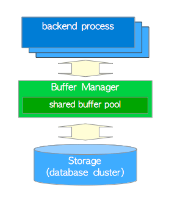
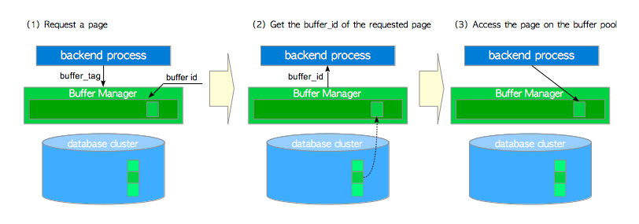
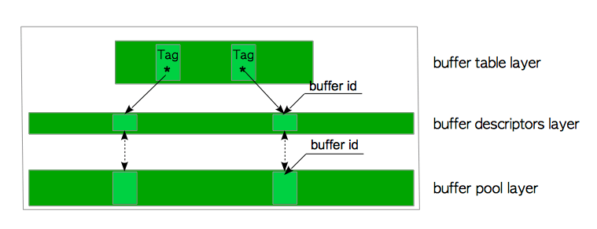

# 8  缓冲区管理器（Buffer Manager）

>附：缓冲（Buffer）和缓存（Cache）的区别
>
>Buffer和Cache翻译成中文分别是“缓冲”和“缓存”。buffer和cache都是一部分内存，内存的作用就是缓解CPU和IO（如，磁盘）的速度差距的。
>
>CPU计算了一些数据后，在内存中进行临时存放，到一定数量后再统一放到硬盘中，这时要用的内存就是buffer；
>
>CPU要计算时，需要把数据从磁盘中读出来，临时先放到内存中，这部分内存就是cache。
>
>cache 是为了弥补高速设备和低速设备的鸿沟而引入的中间层，最终起到加快访问速度的作用。而 buffer 的主要目的进行流量整形，把突发的大数量较小规模的 I/O 整理成平稳的小数量较大规模的 I/O，以减少响应次数（比如从网上下电影，你不能下一点点数据就写一下硬盘，而是积攒一定量的数据以后一整块一起写，不然硬盘都要被你玩坏了）。
>
>原文链接：https://blog.csdn.net/zsx157326/article/details/79010239

缓冲管理器管理共享内存和持久性存储之间的数据传输，并且可能对DBMS的性能产生显著影响。 PostgreSQL缓冲区管理器非常有效地工作。

在本章中，将介绍PostgreSQL缓存区管理器。第一节提供了概述，随后的小节介绍了以下主题：

A buffer manager manages data transfers between shared memory and persistent storage and can have a significant impact on the performance of the DBMS. The PostgreSQL buffer manager works very efficiently.

In this chapter, the PostgreSQL buffer manager is described. The first section provides an overview and the subsequent sections describe the following topics:

- 缓冲区管理器架构
- 缓冲区管理器锁
- 缓冲区管理器如何工作
- 环形缓冲区（Ring buffer）
- 冲洗脏页（Flushing of dirty pages）

**图 8.1. 缓冲区管理器、存储和后端进程之间的关系**




## 8.1. 概述

本节介绍了几个关键概念，以便在后续各节中的理解。

### 8.1.1. 缓冲区管理器架构

PostgreSQL缓冲区管理器包含一个缓冲区表、缓冲区描述符和缓冲池，这将在下一节中介绍。 **缓存池（buffer pool）**层存储数据文件页，例如表和索引，以及[空闲空间映射（freespace maps）](http://www.interdb.jp/pg/pgsql05.html#_5.3.4.) 和 [可见性映射（visibility maps）](http://www.interdb.jp/pg/pgsql06.html#_6.2.)。缓冲池是一个数组，即每个插槽存储一个数据文件的一个页。缓存池阵列的索引称为**buffer_id**。

[小节 8.2](http://www.interdb.jp/pg/pgsql08.html#_8.2.) 和 [8.3](http://www.interdb.jp/pg/pgsql08.html#_8.3.) 介绍了缓存区管理器内部的详细情况。

### 8.1.2. 缓冲区标签（Buffer Tag）

在PostgreSQL中，可以为所有数据文件的每一页分配一个唯一的标签，即**缓冲区标签**。当缓冲区管理器收到请求时，PostgreSQL使用所需页面的buffer_tag。

 [缓冲区标签](javascript:void(0))包含3个值：**RelFileNode**和其页所属关系的**派生号（fork number）**，以及其页的**块号（block number）**。表、空闲空间映射和可见性映射的派生编号分别在0、1和2中定义。

例如，buffer_tag '{(16821, 16384, 37721), 0, 7}' 标识位于第7个块中的页，其relation OID和派生号分别为37721和0；该relation在OID为16821的表空间下的OID为16384的数据库中。同样地，buffer_tag '{(16821, 16384, 37721), 1, 3}' 标识位于自由空间映射的第3个块中的页，其OID和派生号分别为37721和1。

```c-monosp
/*
 * Buffer tag identifies which disk block the buffer contains.
 *
 * Note: the BufferTag data must be sufficient to determine where to write the
 * block, without reference to pg_class or pg_tablespace entries.  It's
 * possible that the backend flushing the buffer doesn't even believe the
 * relation is visible yet (its xact may have started before the xact that
 * created the rel).  The storage manager must be able to cope anyway.
 *
 * Note: if there's any pad bytes in the struct, INIT_BUFFERTAG will have
 * to be fixed to zero them, since this struct is used as a hash key.
 */
typedef struct buftag
{
	RelFileNode rnode;			/* physical relation identifier */
	ForkNumber	forkNum;
	BlockNumber blockNum;		/* blknum relative to begin of reln */
} BufferTag;
```

### 8.1.3. 后端进程如何读取页

本小节介绍后端进程如何从缓冲区管理器中读取页（图 8.2）。

**图 8.2. 后端如何从缓冲区管理器中读取页**



- （1）读取表或索引页时，后端进程会将包含页的buffer_tag的请求发送到缓冲区管理器。
- （2）缓冲区管理器会返回buffer_ID（存储了请求页的插槽的）。如果请求的页未存储在缓冲池中，则缓冲区管理器将页面从持久性存储加载到其中一个缓冲池插槽中，然后返回buffer_ID的插槽。
- （3）后端进程访问buffer_ID的插槽（以读取所需的页）。

当后端进程修改缓冲池中的页面（例如，通过插入元组）时，尚未刷到存储中的修改后的页称为 **脏页（dirty page）**。

[小节 8.4](http://www.interdb.jp/pg/pgsql08.html#_8.4.) 介绍了缓冲区管理器的工作方式。

### 8.1.4. 页替换算法

当所有缓冲池插槽均被占用但请求的页未被存储时，缓冲管理器必须在缓冲池中选择一个页，该页将由请求的页替换。通常，在计算机科学领域中，页选择算法称为*页替换算法（page replacement algorithms）*，而被选定的页面称为**victim page**。

自计算机科学问世以来，对页面替换算法的研究一直在进行。由于，先前已经提出了许多替换算法。从版本8.1开始，PostgreSQL使用了**clock sweep**，因为它比以前版本中使用的LRU算法更简单、更高效。

[小节 8.4.4](http://www.interdb.jp/pg/pgsql08.html#_8.4.4.) 详细介绍了clock-sweep。

### 8.1.5. 刷脏页

脏页最终应刷新到存储中；但是，缓冲区管理器需要协助才能执行此任务。在PostgreSQL中，两个后台进程 - **checkpointer **和**background writer** - 负责此任务。

[小节 8.6](http://www.interdb.jp/pg/pgsql08.html#_8.6.) 介绍了checkpointer和background writer。

> **Direct I/O**
>
> PostgreSQL  **不** 支持Direct I/O，尽管有时会对其讨论。如果你想了解更多详细内容，请参阅pgsql-ML上的[这个讨论](http://www.postgresql.org/message-id/529E267F.4050700@agliodbs.com)和[这篇文章](http://lwn.net/Articles/580542/)。

## 8.2. 缓冲区管理器架构

PostgreSQL缓冲管理器包换三层：即 *缓冲区表（buffer table）*、 *缓冲区描述符（buffer descriptors）*和 *缓冲池（buffer pool）* （图 8.3）：

**图 8.3. 缓冲管理器的三层架构**



- **buffer pool**是一个数组。每个插槽存储一个数据文件页。数组插槽的索引称为*buffer_id*。
- **buffer descriptors**层是buffer descriptors的数组。每个描述符都与缓冲池插槽有一对一的对应关系, 并持有相应插槽中存储页的元数据。
  请注意, 为了方便起见, 采用了 “缓冲区描述符图层” 一词, 并且仅在本文档中使用。
- **buffer table**是一个哈希表, 用于存储（存储页的）*buffer_tag* 以及 （持有存储页各元数据的描述符的）*buffer_id*之间的关系。

在以下小节中将详细介绍这些层。

### 8.2.1. 缓冲区表（Buffer Table）

一张buffer table可以被逻辑划分为三部分：一个哈希函数（hash function）、哈希存储桶插槽（hash bucket slots）和数据条目（data entries）（图 8.4）。

内置的哈希函数将buffer_tags映射到哈希存储桶插槽。即使哈希存储桶插槽的数量大于缓冲池插槽的数量，也会发生冲突。因此，buffer table使用带*linked lists*方法的*separate chaining*来解决冲突。当数据条目被映射到相同的存储桶插槽时，此方法将条目存储在相同的linked list中，如 图 8.4 所示。

**图 8.4. 缓冲区表**


一个数据条目包括两个值: 页的buffer_tag和持有页的元数据的描述符的buffer_id。例如, 一个数据条目 “Tag_A, id=1” ，意味着带有buffer_id为1的buffer descriptor 存储标记为tag_A 的页的元数据。

> **哈希函数**
>
> 哈希函数是 [calc_bucket()](https://doxygen.postgresql.org/dynahash_8c.html#ae802f2654df749ae0e0aadf4b5c5bcbd) 和 [hash()](https://doxygen.postgresql.org/rege__dfa_8c.html#a6aa3a27e7a0fc6793f3329670ac3b0cb)的组合函数。以下是其作为伪函数的表示。

```c
uint32 bucket_slot = calc_bucket(unsigned hash(BufferTag buffer_tag), uint32 bucket_size)
```

请注意，此处不解释基本操作（查找，插入和删除数据条目）。这些是非常常见的操作，将在以下各节中进行说明。

### 8.2.2. 缓冲区描述符（Buffer Descriptor）

本子节介绍了缓冲区描述符的结构, 下一节将介绍缓冲区描述符层。

缓冲区描述符将存储页的元数据保存在相应的缓冲池插槽中。缓冲区描述符结构由[BufferDesc](javascript:void(0))定义。虽然此结构有许多字段, 但主要的如下所示:

```c-monosp
/*
 * Flags for buffer descriptors
 *
 * Note: TAG_VALID essentially means that there is a buffer hashtable
 * entry associated with the buffer's tag.
 */
#define BM_DIRTY                (1 << 0)    /* data needs writing */
#define BM_VALID                (1 << 1)    /* data is valid */
#define BM_TAG_VALID            (1 << 2)    /* tag is assigned */
#define BM_IO_IN_PROGRESS       (1 << 3)    /* read or write in progress */
#define BM_IO_ERROR             (1 << 4)    /* previous I/O failed */
#define BM_JUST_DIRTIED         (1 << 5)    /* dirtied since write started */
#define BM_PIN_COUNT_WAITER     (1 << 6)    /* have waiter for sole pin */
#define BM_CHECKPOINT_NEEDED    (1 << 7)    /* must write for checkpoint */
#define BM_PERMANENT            (1 << 8)    /* permanent relation (not unlogged) */

src/include/storage/buf_internals.h
typedef struct sbufdesc
{
   BufferTag    tag;                 /* ID of page contained in buffer */
   BufFlags     flags;               /* see bit definitions above */
   uint16       usage_count;         /* usage counter for clock sweep code */
   unsigned     refcount;            /* # of backends holding pins on buffer */
   int          wait_backend_pid;    /* backend PID of pin-count waiter */
   slock_t      buf_hdr_lock;        /* protects the above fields */
   int          buf_id;              /* buffer's index number (from 0) */
   int          freeNext;            /* link in freelist chain */

   LWLockId     io_in_progress_lock; /* to wait for I/O to complete */
   LWLockId     content_lock;        /* to lock access to buffer contents */
} BufferDesc;
```

- **tag**将存储页的*buffer_tag*保存在相应的缓冲池插槽中(buffer_tag在[小节 8.1.2](http://www.interdb.jp/pg/pgsql08.html#_8.1.2.)中定义)。

- **buffer_id**标识描述符(等效于相应缓冲池插槽中的*buffer_tag*)。

- **refcount**保存当前访问关联存储页的PostgreSQL进程的数量。它也称为 **pin count**。当PostgreSQL进程访问存储的页面时, 其重新计数必须加1(refcount ++)。访问页面后, 其重新计数必须减1(重新计数–)。
  当refcount为零时，即当前关联的存储页没有被访问, 则该页 **unpinned**;否则为**pinned**。

- **usage_count**保存关联存储页自加载到相应的缓冲池插槽以来被访问的次数。请注意，页面替换算法中使用了usage_count ([小节 8.4.4](http://www.interdb.jp/pg/pgsql08.html#_8.4.4.))。

- context_lock和io_in_process_lock是轻量级锁, 用于控制对关联存储页的访问。这些字段在[小节 8.3.2](http://www.interdb.jp/pg/pgsql08.html#_8.3.2.)中进行了说明。

- flags

  可以保存关联存储页的多个状态。主要状态如下:

  - **dirty bit**标识存储的页面是否脏。
  - **valid bit**标识存储的页面是否可以读取或写入 (有效)。例如，如果此位是*valid*, 则相应的缓冲池插槽将存储一个页面，并且此描述符 (有效位) 保存页面元数据；因此，存储的页面可以读取或写入。如果此位无效，则此描述符不包含任何元数据。这意味着无法读取或写入存储的页面，或者缓冲区管理器正在替换存储的页面。
  - **io_in_process_lock**标识着缓冲区管理器是否正在读写从存储或者到存储的关联页面。换句话说, 此bit表示单个进程是否持有此描述符的io_in_process_lock。

- freeNext是一个指向下一个描述符的指针, 用于生成一个freelist, 这将在下一个小节中介绍。

结构体 *BufferDesc* 定义在 [src/include/storage/buf_internals.h](https://github.com/postgres/postgres/blob/master/src/include/storage/buf_internals.h) 中。

为了简化以下描述，定义了三个描述符状态

- **Empty**：当相应的缓冲池插槽不存储页 (即*refcount* 和 *usage_count*  为 0) 时， 此描述符的状态为 *empty*。
- **Pinned**：当相应的缓冲池插槽存储一个页，并且PostgreSQL进程正在访问该页 (即*refcount*和*usage_count*大于等于1) 时, 此缓冲区描述符的状态为*pinned*。
- **Unpinned**：当相应的缓冲池插槽存储一个页， 但没有PostgreSQL进程访问该页(即usage_count大于等于 1，但refcount为0) 时，此缓冲区描述符的状态为*unpinned*。

每个描述符具有上述状态之一。描述符状态相对于特定条件而变化，这将在下一节中进行介绍。
在下图中, 缓冲区描述符的状态由彩色框表示。


此外， 脏页被表示为"X"。例如，Unpinned的脏描述符由表示。

### 8.2.3. 缓冲区描述符层（Buffer Descriptors Layer）

缓冲区描述符的集合构成了一个数组。在本文档中，该数组称为*缓冲区描述符层（*buffer descriptors layer*）*。
当PostgreSQL服务启动时，所有缓冲区描述符的状态为*empty*。在PostgreSQL中，这些描述符包含一个链表，名为**freelist**（图 8.5）。

请注意，PostgreSQL中的**freelist**与Oracle中的**freelists**是完全不同的概念。PostgreSQL的freelist仅仅是空缓冲区描述符的链表。在PostgreSQL 中，空闲空间映射（在 [小节 5.3.4](http://www.interdb.jp/pg/pgsql05.html#_5.3.4.)中介绍的）与Oracle中的freelists起着相同作用。

**图 8.5. 缓冲区管理器的初始状态**


图8.6 显示了第一页是如何加载的。

- （1）从freelist的顶部检索空描述符，并将其pin住（即将refcount和usage_count都增加1)。
- （2）在buffer table中插入新条目，该条目持有（第1页的标记和检索到的描述符的buffer_id之间的）关系。
- （3）将新的页从持久化存储加载到相应的缓冲池槽位。
- （4）将新的页的元数据保存到检索到的描述符中。

第2个页和后续页以类似方式加载。其他细节在[小节 8.4.2](http://www.interdb.jp/pg/pgsql08.html#_8.4.2.)中提供。

**图 8.6 加载第一个page页**


从freelist中检索的描述符始终持有page页的元数据。换句话说，继续使用的非空描述符不会返回到空闲列表。然而，相关描述符将再次添加到freelist中，并且当发生以下任一情况时，描述符状态将变为’empty’：

1. 表或索引已被移除。
2. 数据库已被移除。
3. 表或索引已被使用VACUUM FULL命令清除。

 *为什么空描述符构成freelist？*

freelist存在的原因是为了立即获得第1个描述符。这是动态内存资源分配的常用做法。可以参阅[该说明](https://en.wikipedia.org/wiki/Free_list)。

缓冲区描述符层包含一个无符号的32位整数变量，即**nextVictimBuffer**。此变量用于 [小节 8.4.4](http://www.interdb.jp/pg/pgsql08.html#_8.4.4.)中介绍的页替换算法。

### 8.2.4. 缓冲池（Buffer Pool）

缓冲池是一个存储数据文件页面的简单数组，例如表和索引。缓冲池阵列的索引称为buffer_ids。

缓冲池插槽大小为8KB，等于一个page页的大小。因此，每个槽可以存储1个完整的page页。

## 8.3. 缓冲区管理器锁（Buffer Manager Locks）

缓冲区管理器使用许多锁来实现许多不同的目的。本节介绍锁以便后续章节中所需。

请注意，本节中描述的锁，是缓冲区管理器的同步机制的一部分;它们与任何SQL语句和SQL选项**无关**。

### 8.3.1. 缓冲区表锁（Buffer Table Locks）

**BufMappingLock**保护整个缓冲区表的数据完整性。它是一种轻量级锁，可用于共享（share）和独占（exclusive）模式。在buffer table中搜索一个条目时，后端进程持有共享的 BufMappingLock。当插入或删除条目时，后端进程持有一个排他锁（exclusive lock）。

BufMappingLock 被拆分为分区以减少缓冲表中的争用（默认为128个分区）。每个BufMappingLock分区都保护相应哈希桶槽的一部分。

图 8.7 显示了一个拆分BufMappingLock的典型示例。两个后端进程在exclusive模式下可以同时持有各自的BufMappingLock分区，以便插入新的数据条目。如果BufMappingLock是单个系统范围的锁，则两个进程都等待另一个进程的处理，具体取决于那个启动的处理。

**图8.7 两个进程同时（以独占模式）获取BufMappingLock的相应分区，以插入新数据条目**


缓冲表需要许多其他的锁。例如，缓冲表内部使用spin lock来删除条目。但是，因为在本文档中不需要，所以这些锁的描述被省略了。

在9.4版本之前，在默认情况下，BufMappingLock已被分为16个单独的锁。

### 8.3.2. Locks for Each Buffer Descriptor

每个缓冲区描述符使用两个轻量级锁，**content_lock**和**io_in_progress_lock**，来控制对相应缓冲池槽中存储页的访问。当自己字段的值被检查或更改时，就使用spinlock。

#### 8.3.2.1. content_lock

content_lock是一个典型的锁，它强制访问限制。它可以在*共享（shared）* and *独占（exclusive）* 模式下使用。

当读取一个页时，后端进程获取存储该页的缓冲区描述符的共享content_lock锁。

但是，当执行以下操作之一时，会获取独占的content_lock锁：

- 将行（即tuples）插入到存储页或更改存储页面中tuples的t_xmin/t_xmax字段（t_xmin和t_xmax在 [小节 5.2](http://www.interdb.jp/pg/pgsql05.html#_5.2.)中介绍；简单地说，当删除或更新行时，相关tuples的这些字段将被更改)。

- 物理地移除tuples或压缩存储页面上的空闲空间（通过分别在 [第6章](http://www.interdb.jp/pg/pgsql06.html) and [第7章](http://www.interdb.jp/pg/pgsql07.html)中介绍的vacuum和HOT操作触发，分别在第6章和第7章中描述）。

- 冻结在存储页中的tuples（冻结（freezing）在[小节 5.10.1](http://www.interdb.jp/pg/pgsql05.html#_5.10.1.) and [小节 6.3](http://www.interdb.jp/pg/pgsql06.html#_6.3.)中有所介绍）。

官方[README](https://github.com/postgres/postgres/blob/master/src/backend/storage/buffer/README)文件中有更多详细信息。

#### 8.3.2.2. io_in_progress_lock

io_in_progress锁用于等待缓冲区上的I/O完成。当PostgreSQL进程 从/到 存储中 加载/写入 page页数据时，该进程（在访问存储时）持有相应描述符的独占io_in_progress锁。

#### 8.3.2.3. spinlock

当检查或改变标记或其他字段（例如refcount和usage_count)时，使用spinlock。两个spinlock的用例，具体示例如下：
（1）以下显示了如何pin住缓冲区描述符：
		 1.获取缓冲区描述符的spinlock。
		 2.将其refcount和usage_count的值增加1。
		 3.释放spinlock锁。

- ```c-monosp
  LockBufHdr(bufferdesc);    /* Acquire a spinlock */
  bufferdesc->refcont++;
  bufferdesc->usage_count++;
  UnlockBufHdr(bufferdesc); /* Release the spinlock */
  ```

（2）以下显示如何将脏位设置为’1’：
         1.获取缓冲区描述符的spinlock。
         2.使用按位操作将脏位设置为“1”。
         3.释放spinlock锁。

- ```c-monosp
  #define BM_DIRTY             (1 << 0)    /* data needs writing */
  #define BM_VALID             (1 << 1)    /* data is valid */
  #define BM_TAG_VALID         (1 << 2)    /* tag is assigned */
  #define BM_IO_IN_PROGRESS    (1 << 3)    /* read or write in progress */
  #define BM_JUST_DIRTIED      (1 << 5)    /* dirtied since write started */
  
  LockBufHdr(bufferdesc);
  bufferdesc->flags |= BM_DIRTY;
  UnlockBufHdr(bufferdesc);
  ```

执行改变其他位，与以上方式相同。

*用原子操作替代缓冲区管理器自旋锁（spinlock）*

在版本9.6中，缓冲区管理器的自旋锁将被替换为原子操作。查看[result of commitfest](https://commitfest.postgresql.org/9/408/)。如果想了解详细信息，请参阅此 [该讨论](http://www.postgresql.org/message-id/flat/2400449.GjM57CE0Yg@dinodell#2400449.GjM57CE0Yg@dinodell)。

## 8.4. 缓冲区管理器如何工作

本节介绍缓冲区管理器的工作原理。当后端进程想要访问所需页时，它会调用*ReadBufferExtended*函数。
*ReadBufferExtended*函数的行为取决于三种逻辑情况。每种情况在以下小节中介绍。此外，PostgreSQL clock sweep 页替换算法在最后一节中介绍。

### 8.4.1. **访问存储在缓冲池中的page页**

首先，介绍最简单的情况，即所需的page页已经存储在缓冲池中。在这种情况下，缓冲区管理器执行以下步骤：

（1）创建所需页的*buffer_tag*（在此示例中，buffer_tag为’Tag_C’）并使用哈希函数计算包含创建的buffer_tag相关联条目的hash bucket slot。
（2）在共享模式下，获取覆盖哈希桶槽的 BufMappingLock 分区（该锁将在步骤(5)中释放）。
（3）查找标签为“Tag_C”的条目，并从条目中获取*buffer_id*。在此示例中，buffer_id为2。
（4）将缓冲区描述符固定为buffer_id 2，即描述符的refcount和usage_count增加1（[小节 8.3.2](http://www.interdb.jp/pg/pgsql08.html#_8.3.2.) 描述了pinning）。
（5）释放BufMappingLock。
（6）使用buffer_id 2访问缓冲池槽。

**图 8.8. 访问存储在缓冲池中的页**


然后，当从缓冲池槽中的页读取行时，PostgreSQL进程获取相应缓冲区描述符的共享content_lock。因此，缓冲池槽可以由多个进程同时读取。

当向页中插入（以及更新或删除）行时，Postgres进程获取相应缓冲区描述符的*exclusive content_lock* （请注意，页面的脏位必须设置为“1”）。

访问页面后，相应缓冲区描述符的refcount值会减1。

### 8.4.2. 从存储（Storage）加载页到空槽（Empty Slot）

在第二种情况下，假设所需页面不在缓冲池中，并且空闲列表具有空闲元素（空描述符）。在这种情况下，缓冲区管理器执行以下步骤：
（1）查找缓冲区表 (我们假设它未被找到).

​		1.创建所需页面的buffer_tag（在此示例中，buffer_tag为’Tag_E’）并计算哈希桶槽。

​		2.以共享模式获取BufMappingLock分区。

​		3.查找缓冲区表（根据假设是未被找到的）。

   	4.释放BufMappingLock。

（2）从freelist中获取空缓冲区（*empty buffer*）描述符，并将其固定。在该示例中，获得的描述符的buffer_id是4。
（3）以独占模式获取BufMappingLock分区（此锁将在步骤（6）中被释放）。
（4）创建一个由buffer_tag ’Tag_E’和buffer_id 4组成的新数据条目；将创建的条目插入缓冲区表。
（5）使用buffer_id 4，将所需的页数据从存储加载到缓冲池槽，如下所示：

​		1.获取相应描述符的独占io_in_progress_lock。

​		2.将相应描述符的io_in_progress位设置为1，以防止其他进程访问。

​		3.将所需的页数据从存储加载到缓冲池槽。

​		4.更改相应描述符的状态； io_in_progress 位设置为‘0’，*valid*位设置为‘1’。

​		5.释放io_in_progress_lock。
（6）释放BufMappingLock。
（7）使用buffer_id 4访问缓冲池槽。

**图8.9 将页从存储加载到空插槽**


### 8.4.3. 将Page页从磁盘（Storage）加载到Victim Buffer Pool Slot

在这种情况下，假设所有缓冲池槽都被页占用，但所需的页没有被存储。缓冲区管理器执行以下步骤：

（1）创建所需页面的buffer_tag并查找缓冲表。在这个例子中，我们假设buffer_tag是’Tag_M’（所需的页没有被找到）。
（2）使用clock-sweep算法选择一个victim buffer pool slot，从缓冲区表中获取旧条目，这个旧的条目包含了victim buffer pool slot的buffer_id，并将victim pool slot固定在缓冲区描述符层中。在此示例中， victim slot的buffer_id为5，旧条目为“Tag_F, id = 5”。clock-sweep将在[下一小节](http://www.interdb.jp/pg/pgsql08.html#_8.4.4.)中介绍。
（3）如果victim页数据是脏的，则刷新改页面（写入和fsync）;否则进入步骤（4）。
            在使用新数据覆盖之前，必须将脏页写入磁盘(storage)。刷脏页面的步骤如下：

​			1.获取（buffer_id 5的，在步骤6中释放到)描述符的共享content_lock和独占io_in_progress锁。

​			2.更改相应描述符的状态; io_in_progress位设置为“1”，just_dirtied位设置为“0”。

​			3.根据具体情况，调用XLogFlush()函数将WAL缓冲区上的WAL数据写入当前WAL段文件（详细信息省略; WAL和XLogFlush函数在 [第9章](http://www.interdb.jp/pg/pgsql09.html)中介绍）。

​			4.将victim页数据刷新到磁盘。

​			5.更改相应描述符的状态; io_in_progress位设置为“0”，valid位设置为“1”。

​			6.释放io_in_progress和content_lock锁。

（4）以独占模式，获取覆盖包含旧条目的插槽的旧BufMappingLock分区。
（5）获取新的BufMappingLock分区，并将新条目插入缓冲区表：

​			1.创建由新buffer_tag’ Tag_M’和victim的buffer_id组成的新条目。

​			2.以独占模式获取覆盖包含新条目的插槽的新BufMappingLock分区。

​			3.将新条目插入缓冲区表。

**表 8.10. 将page页从磁盘（storage）加载到victim buffer pool slot**


（6）从缓冲表中删除旧条目，并释放旧的BufMappingLock分区。
（7）将所需的页从磁盘加载到victim buffer slot。然后，更新buffer_id为5的描述符的标记；脏位设置为’0’,并初始化其他位。
（8）释放新的BufMappingLock分区。
（9）使用buffer_id 5访问缓冲池槽。

**图8.11 将页面从磁盘加载到victim buffer pool slot（接续前面 图 8.10)**


### 8.4.4. Page页替换算法: Clock Sweep

本节的其余部分介绍了**clock-sweep**算法。该算法是一个NFU（Not Frequently Used）的变体，具有低开销；它能有效地选择不常使用的页。

将缓冲区描述符设想为一个循环列表（图 8.12）。 nextVictimBuffer是一个无符号的32位整数，它总是指向一个缓冲区描述符并顺时针旋转。伪代码和算法描述如下：

> *Pseudocode: clock-sweep*

```c
     WHILE true
(1)     Obtain the candidate buffer descriptor pointed by the nextVictimBuffer
(2)     IF the candidate descriptor is unpinned THEN
(3)	       IF the candidate descriptor's usage_count == 0 THEN
	            BREAK WHILE LOOP  /* the corresponding slot of this descriptor is victim slot. */
	       ELSE
		    Decrease the candidate descriptpor's usage_count by 1
               END IF
         END IF
(4)     Advance nextVictimBuffer to the next one
      END WHILE 
(5) RETURN buffer_id of the victim
```

> （1）获取nextVictimBuffer指向的候选缓冲区描述符.
> （2）如果候选缓冲区描述符的状态是unpinning，则进入步骤(3);否则进入步骤(4)。
> （3）如果候选描述符的usage_count为0，则选择该描述符的对应槽作为一个victim，并进入步骤(5)；否则，将此描述符的usage_count减1，并继续执行步骤(4)。
> （4）将nextVictimBuffer推进到下一个描述符（如果到了最后，则绕回去）并返回步骤(1)。重复直到找到victim.
> （5）返回victim的buffer_id.

具体的例子如 图 8.12 所示。缓冲区描述符显示为蓝色或青色框，框中的数字显示每个描述符的usage_count。

**图 8.12. Clock Sweep.**


​	1）nextVictimBuffer指向第一个描述符（buffer_id 1）；但是，此描述符被跳过，因为它的状态是pinned。
​	2）nextVictimBuffer指向第二个描述符（buffer_id 2）。此描述符的状态是unpinned，但其usage_count为2；因此，usage_count减少1，nextVictimBuffer前进到第三候选缓存区。
​	3）nextVictimBuffer指向第三个描述符（buffer_id 3）。状态描述符为unpinned，其usage_count为0；因此，被选为本轮的victim。

每当*nextVictimBuffer*扫描unpinned的描述符时，其usage_count减少1。因此，如果缓冲池中存在unpinned的描述符，则此算法始终可以通过旋转nextVictimBuffer，找到其usage_count为0的victim。

## 8.5. 环形缓冲区（Ring Buffer）

在读或写大表时，PostgreSQL使用**环形缓冲区（ring buffer）** 而不是缓冲池。环形缓冲区是一个小的并且临时的缓冲区域。当满足下面列出的任何条件时，将为共享内存分配一个环形缓冲区：

**1.bulk-reading**
	当扫描的对象大小超过缓冲池大小四分之一（shared_buffers/4)时。这种情况下，环形缓冲区大小为256KB。

**2.bulk-writing**
	执行下面列出的SQL命令时，环形缓冲区大小为16MB。

​	[COPY FROM](http://www.postgresql.org/docs/current/static/sql-copy.html)命令。
​	[CREATE TABLE AS](http://www.postgresql.org/docs/current/static/sql-createtableas.html)命令。
​	[CREATE MATERIALIZED VIEW](http://www.postgresql.org/docs/current/static/sql-creatematerializedview.html)或[REFRESH MATERIALIZED VIEW](http://www.postgresql.org/docs/current/static/sql-refreshmaterializedview.html)命令。
​	[ALTER TABLE](http://www.postgresql.org/docs/current/static/sql-altertable.html)命令。
**3.vacuum processing**
   当autovacuum执行vacuum处理时。这种情况下，环形缓冲区大小为256KB。

分配的环形缓冲区在使用后立即释放。

环形缓冲区的好处是显而易见的。在不使用环形缓冲区的情况下，如果后端进程读取一个巨大的表，所有存储在缓存池的页面被删除(踢出)；那么，缓存命中率就会降低。环形缓冲区可以有效的避免此类问题。

> **为什么批量读取（bulk-reading）和vacuum的默认环形缓冲区大小为256KB?**
> 为什么是256KB？答案在缓冲区管理器的源码目录下的[README](https://github.com/postgres/postgres/blob/master/src/backend/storage/buffer/README)中有解释。
>
> > 对于顺序扫描，使用256KB环。这么小的尺寸在L2级缓存是合适的，这使得从OS缓存到共享缓冲区缓存的页传输效率更高。在通常情况下再更小一些也是足够了，但是环必须足够大，以同时容纳扫描到的同时pin住的所有页。(截断)

## 8.6. 冲刷脏页（Flushing Dirty Pages）

除了替换victim页面之外，checkpointer和后台写进程（ background writer processes ）将脏页面刷到磁盘。两个进程都具有相同的功能（冲刷脏页）；但是，它们有不同的作用和行为。

checkpointer进程将checkpoint record（检查点记录）写入WAL段文件，并在检查点开始时刷脏页。[小节 9.7](http://www.interdb.jp/pg/pgsql09.html#_9.7.) 介绍了检查点以及何时开始。

后台写进程的作用是减少检查点的密集写的影响。后台写进程持续一点一点地刷脏页面，对数据库活动的影响最小。默认情况下，后台写进程每隔200毫秒唤醒（由 [bgwriter_delay](http://www.postgresql.org/docs/current/static/runtime-config-resource.html#GUC-BGWRITER-DELAY)定义）并最大限度刷[bgwriter_lru_maxpages](http://www.postgresql.org/docs/current/static/runtime-config-resource.html#GUC-BGWRITER-LRU-MAXPAGES)（默认值为100个页）。

> **checkpointer为什么与后台写进程是分开的？**
> 在版本9.1及之前，后台写进程定期执行检查点处理。在版本9.2中，checkpointer进程已与后台写进程分开。原因记录在一篇标题为“[Separating bgwriter and checkpointer](https://www.postgresql.org/message-id/CA%2BU5nMLv2ah-HNHaQ%3D2rxhp_hDJ9jcf-LL2kW3sE4msfnUw9gA%40mail.gmail.com)”的提议中，其中一些内容如下所示：
>
> > 目前（2011年），bgwriter进程执行后台写、检查点和其他一些职责。这意味着，在不停止后台写入的情况下，无法执行最终检查点fsync，因此在一个进程中执行这两项操作会产生负面的性能影响。
> > 此外，我们在9.2中的目标是，用latch代替polling loop以降低资源使用。 bgwriter loop的复杂性很高，似乎不太可能采用使用latch的这样的干净方法。（截断）

