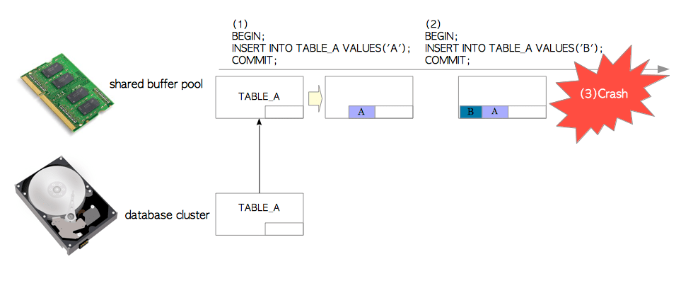
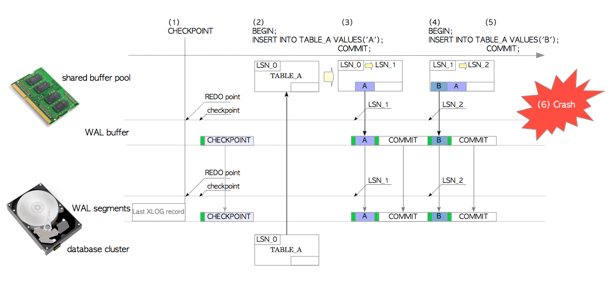
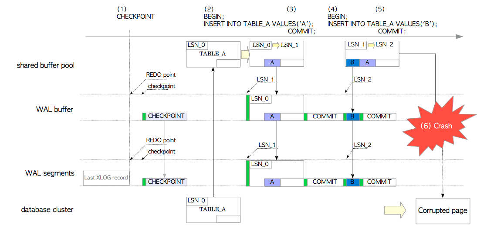
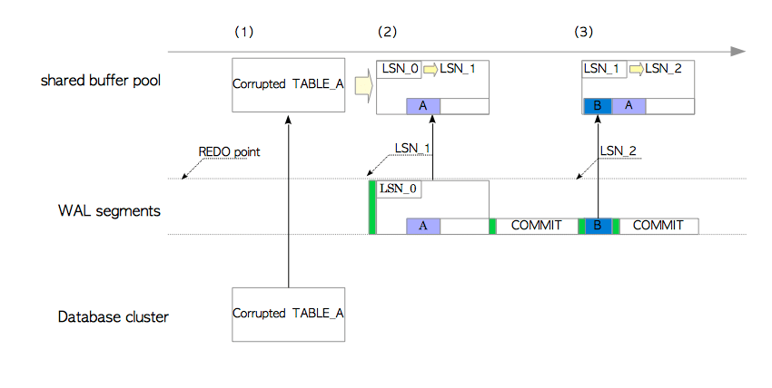

# 9 预写日志 — WAL

**事务日志（Transaction log）**是数据库的重要组成部分，因为即使发生系统故障，都要求所有数据库管理系统必须不丢失任何数据。它是数据库系统中所有更改和操作的历史日志，以确保不会因诸如电源故障或其他导致服务器崩溃的服务器故障之类的故障，而丢失任何数据。由于日志包含有关已经执行的每个事务的足够信息，因此在服务器崩溃的情况下，数据库服务器应该能够通过重演事务日志中的更改和操作来恢复数据库集群。

在计算机科学领域，**WAL**是**Write Ahead Logging **的首字母缩写，是一种将更改和动作都写入事务日志的协议或规则；而在PostgreSQL中，**WAL**是**Write Ahead Log**的首字母缩写。此处，该术语用作事务日志的同义词，还用于指代与将操作写入事务日志（WAL）有关的已实现机制。尽管这有点令人困惑，但在本文档中采用了PostgreSQL中的定义。

WAL机制最初是在版本7.1中实现的，目的是减轻服务器崩溃的影响。这也使时间点恢复（PITR）和流复制（SR）的实现成为可能，这两者将在[第10章](http://www.interdb.jp/pg/pgsql10.html) and [第11章](http://www.interdb.jp/pg/pgsql11.html)分别介绍。

尽管对WAL机制的理解对于使用PostgreSQL进行系统集成和管理至关重要，但该机制的复杂性使得无法简要概述它。因此，对PostgreSQL中WAL的完整解释如下。在第一部分中，提供了WAL的总体情况，介绍了一些重要的概念和关键字。在随后的部分中，介绍了以下主题：

- WAL (事务日志) 的逻辑和物理结构
- WAL数据的内部布局
- WAL数据的写入
- WAL写入处理过程
- checkpoint处理过程
- 数据库恢复处理过程
- 管理 WAL 段文件
- 连续归档

## 9.1. 综述

让我们看一下WAL机制的综述。为了阐明WAL在处理的问题，第一节介绍了如果PostgreSQL未实现WAL，那么当崩溃时发生的情况。第二部分介绍一些关键概念，并概述本章的主要主题 - WAL数据的写入和数据库恢复处理。最后一节完成了WAL的概述，并添加了另一个关键概念。

在本节中，为了简化说明，使用了仅包含一个page页的表TABLE_A。

### 9.1.1. 没有WAL时的插入操作

正如 [第8章](http://www.interdb.jp/pg/pgsql08.html)所介绍的，为了提供对关系的page页的有效访问，每个DBMS都实现了共享缓冲池（shared buffer pool）。

假设我们在PostgreSQL的TABLE_A中，插入了一些没有实现WAL功能的数据元组；在图9.1描述了这种情况。

**图 9.1. 没有WAL时的插入操作**



​     （1）发出第一条INSERT语句，PostgreSQL从数据库集簇中将TABLE_A的页面加载到内存（in-memory）共享缓冲池中，并在该页中插入一个元组。该page页不会立即写入数据库集簇。 （如第8章所述，修改后的页通常称为**“脏页（dirty page）”**。）

​	 （2）发出第二条INSERT语句，PostgreSQL将新的元组插入缓冲池的页中。该页尚未被写入存储。

​      （3）如果操作系统或PostgreSQL服务器由于电源故障等原因而出现故障，则所有插入的数据都将丢失。

因此，没有WAL的数据库非常容易受到系统故障的影响。

### 9.1.2. 插入操作和数据库恢复

为了在不影响性能的情况下处理上述系统故障，PostgreSQL支持WAL。在本小节中，将介绍一些关键字和关键概念，然后介绍WAL数据的写入和数据库的恢复。

PostgreSQL将所有修改作为历史记录数据写入持久存储中，来为故障做好预备。在PostgreSQL中，历史数据称作**XLOG记录**或**WAL数据**。

XLOG记录通过（诸如插入、删除或提交操作之类的）更改操作被写入内存中的**WAL缓冲区（WAL buffer）**中。当事务提交/中止时，它们会立即写入存储中的** WAL段文件中。 （确切地说，XLOG记录的写入可能发生在其他情况下。详细信息将在[Section 9.5](http://www.interdb.jp/pg/pgsql09.html#_9.5.).进行介绍）。 XLOG记录的**LSN（Log Sequence Number）**表示将其记录写入事务日志的位置。记录的LSN用作为XLOG记录的唯一ID。

顺便说一句，当我们考虑数据库系统如何恢复时，可能会有一个问题： PostgreSQL从哪个点（point）开始恢复？答案是**REDO point**；也就是，在启动最新的**checkpoint**时写入XLOG记录的位置（PostgreSQL中的检查点已经在[第9.7节](http://www.interdb.jp/pg/pgsql09.html#_9.7.)进行了介绍）。实际上，数据库恢复处理（recovery processing）与*检查点处理（checkpoint processing）*密切相关，并且这两个处理过程是不可分割的。

> WAL和检查点处理是同时在版本7.1中实现的。

由于主要关键字和概念刚刚介绍完，因此从现在开始将介绍使用WAL插入元组。参见图9.2 和以下说明。 （另请参阅[此幻灯片](http://www.slideshare.net/suzuki_hironobu/fig-902)。）

**图 9.2. 有 WAL 时的插入操作**



> **Notation**
>
> ‘*TABLE_A' 的 LSN*’在TABLE_A的页眉中显示pd_lsn的值。 ‘*page*'的LSN‘是相同的方式。

 （1）一个检查点是一个后台进程，它定期执行检查点。每当检查点进程启动时，它都会将一个称为**检查点记录（checkpoint record）**的XLOG记录写入当前WAL段。该记录包含最新REDO点的位置。

 （2）发出第一个INSERT语句，PostgreSQL将TABLE_A的页加载到共享缓冲池中，在该页中插入一个元组，将该语句的XLOG记录创建并写入WAL缓冲区的*LSN_1*的位置，并将TABLE_A的LSN从*LSN_0*更新到*LSN_1*。

在此示例中，此XLOG记录是一对 header-data 和 *tuple entire*。

 （3）在提交此事务时，PostgreSQL长江此提交操作的XLOG记录，并将其写入WAL缓冲区，然后，将WAL缓冲区中的所有XLOG记录从*LSN_1*写入并刷新到WAL段文件。

​	(4)  发送第二个 INSERT 语句，PostgreSQL 向页中插入一个新的元组，创建该元组的XLOG记录并将其写入WAL缓冲区的*LSN_2*位置，并将TABLE_A的LSN从*LSN_1*更新为*LSN_2*。

​	(5) 当该语句的事务提交， PostgreSQL以与步骤（3）中相同的方式运行。

​	(6) 想象当发生操作系统故障的时候。即使共享缓冲池上的所有数据都丢失了，页的所有修改已经作为历史数据写入WAL段文件中。

下面介绍如何将数据库集簇迅速恢复到崩溃之前的状态。无需执行任何特殊操作，因为PostgreSQL将通过重启自动进入恢复模式（recovery-mode）。参见 图9.3（以及这个[幻灯片](http://www.slideshare.net/suzuki_hironobu/fig-903)）。 PostgreSQL将顺序从REDO点读取并重演适当的WAL段文件中的XLOG记录。

**图 9.3.  使用WAL进行数据库恢复**


- (1) PostgreSQL 从相应的WAL段文件，读取第一个INSERT语句的XLOG记录，将TABLE_A的页从数据库集簇加载到共享缓冲池。 

- (2) 在尝试重演XLOG记录之前，PostgreSQL会比较XLOG记录的LSN和相应页的LSN，这样做的原因将会来[第9.8节](http://www.interdb.jp/pg/pgsql09.html#_9.8.)介绍。重演XLOG记录的规则展示如下。

  如果XLOG记录的LSN大于页的LSN，则XLOG记录的数据部分将被插入到页，并且页的LSN会被更新到XLOG记录的LSN。另一方面，如果XLOG记录的LSN较小，则除了读取下一个WAL数据外，别无选择。

  在此示例中，XLOG记录被重演了，因为XLOG记录的LSN (*LSN_1*) 大于表TABLE_A的LSN (*LSN_0*)；因此，TABLE_A的LSN从*LSN_0* 更新为*LSN_1*。

- (3) PostgreSQL 以相同的方式重演剩余的 XLOG r记录。

PostgreSQL可以以这种方式恢复自身，通过按时间顺序重放WAL段文件中写入的XLOG记录。因此，PostgreSQL的XLOG记录显然是**REDO日志**。

> ⚠️   PostgreSQL  不支持 UNDO 日志。

尽管写XLOG记录肯定要花费一定的成本，但是与写整个修改后的页相比这不算什么。与所话费的成本相比，我们确信我们可以获得更大的收益，即系统故障容限。

### 9.1.3. 全页（Full-Page）写入

假定存储在TABLE_A的页数据（page-data）已损坏，因为在后台写入器进程正写入脏页时，操作系统已发生故障。由于无法在损坏的页上重演XLOG记录，因此我们需要其他功能。

PostgreSQL支持一种称为**整页写入（full-page writes）**的功能来处理此类故障。如果启用，在每个检查点之后的每个page页的第一次更改期间，PostgreSQL将一对 header-data和*entire page*作为XLOG记录写入。默认是启用。在PostgreSQL中，包含整个页的XLOG记录称为**backup block（备份块）**（或**full-page image**）。

让我们再次描述元组的插入，但是启用了整页写入（full-page-writes）。参见图9.4和以下说明。

**图 9.4. 元组的整页写入**



​	(1) 检查点启动检查点进程

​	(2) 在第一个INSERT语句的插入中，尽管PostgreSQL的操作方式几乎与上一小节相同，但该XLOG记录是该页的*backup block*（即它包含页的完整性），因为这是此页在最新检查点之后的第一次写入。

​	(3) 在提交此事务时，PostgreSQL的操作方式与上一小节相同。

​	(4) 在第二条INSERT语句插入时，由于该XLOG记录不是备份块，因此PostgreSQL的操作方式与上一部分相同。

​	(5) 该语句的事务提交时，PostgreSQL的运行方式与上一小节相同。

​	(6) 为了演示全页写入的有效性，在这里我们考虑以下情况：由于后台写入器将其写入HDD时发生的操作系统故障，导致存储中的TABLE_A页被破坏。

重启PostgreSQL服务来修复损坏的群集。参见图9.5和以下说明。

**图 9.5. 使用备份块进行数据库恢复**



​	(1) PostgreSQL reads the XLOG record of the first INSERT statement and loads the corrupted TABLE_A's page from the database cluster into the shared buffer pool. In this example, the XLOG record is a backup block, because the first XLOG record of each page is always its backup block according to the writing rule of full-page writes.

​	(2) When a XLOG record is its backup block, another rule of replaying is applied: the record's data-portion (i.e. the page itself) is to be overwritten onto the page regardless of the values of both LSNs, and the page's LSN updated to the XLOG record's LSN.
In this example, PostgreSQL overwrites the data-portion of the record to the corrupted page, and updates the TABLE_A's LSN to *LSN_1*. In this way, the corrupted page is restored by its backup block.

​	(3) Since the second XLOG record is a non-backup block, PostgreSQL operates in the same manner as the instruction in the previous subsection.

PostgreSQL can be recovered even if some data write failures have occurred. (Of course, this does not apply if the file-system or media failure has occurred.)

## 9.2. 事务日志和WAL段文件

Logically, PostgreSQL writes XLOG records into the transaction log which is a virtual file 8-byte long (16 ExaByte).

Since a transaction log capacity is effectively unlimited and so can be said that 8-byte address space is vast enough, it is impossible for us to handle a file with the capacity of 8-byte length. So, a transaction log in PostgreSQL is divided into files of 16-Mbyte, by default, each of which known as *WAL segment*. See Fig. 9.6.

> **WAL segment file size**
>
> In version 11 or later, the size of WAL segment file can be configured using [--wal-segsize](https://www.postgresql.org/docs/11/static/app-initdb.html) option when PostgreSQL cluster is created by initdb command.

**Fig. 9.6. Transaction log and WAL segment files**


The WAL segment filename is in hexadecimal 24-digit number and the naming rule is as follows:

\begin{align} \verb|WAL segment file name| = \verb|timelineId| + (\verb|uint32|) \frac{\verb|LSN|-1}{16\verb|M|*256} + (\verb|uint32|)\left(\frac{\verb|LSN|-1}{16\verb|M|}\right) \% 256 \end{align}

 *timelineId*

PostgreSQL's WAL contains the concept of **timelineId** (4-byte unsigned integer), which is for Point-in-Time Recovery (PITR) described in [Chapter 10](http://www.interdb.jp/pg/pgsql10.html#_10.3.1.). However, the timelineId is fixed to 0x00000001 in this chapter because this concept is not required in the following descriptions.

The first WAL segment file is 000000010000000000000001. If the first one has been filled up with the writing of XLOG records, the second one 000000010000000000000002 would be provided. Files of successor is used in ascending order in succession, after 0000000100000000000000FF has been filled up, next one 000000010000000100000000 will be provided. In this way, whenever the last 2-digit carries over, the middle 8-digit number increases one.

Similarly, after 0000000100000001000000FF has been filled up, 000000010000000200000000 will be provided, and so on.

 *pg_xlogfile_name / pg_walfile_name*

Using the built-in function *pg_xlogfile_name* (version 9.6 or earlier) or *pg_walfile_name* (versoin 10 or later), we can find the WAL segment file name that contains the specified LSN. An example is shown below:

```plsql
testdb=# SELECT pg_xlogfile_name('1/00002D3E');  # In version 10 or later, "SELECT pg_walfile_name('1/00002D3E');"
     pg_xlogfile_name     
--------------------------
 000000010000000100000000
(1 row)
```

## 9.3. Internal Layout of WAL Segment

A WAL segment is a 16 MB file, by default, and it is internally divided into pages of 8192 bytes (8 KB). The first page has a header-data defined by the structure [XLogLongPageHeaderData](javascript:void(0)), while the headings of all other pages have the page information defined by the structure [XLogPageHeaderData](javascript:void(0)). Following the page header, XLOG records are written in each page from the beginning in descending order. See Fig. 9.7.

**Fig. 9.7. Internal layout of a WAL segment file.**


XLogLongPageHeaderData structure and XLogPageHeaderData structure are defined in [src/include/access/xlog_internal.h](https://github.com/postgres/postgres/blob/master/src/include/access/xlog_internal.h). The explanation of both structures is omitted because those are not required in the following descriptions.

## 9.4. Internal Layout of XLOG Record

An XLOG record comprises the general header portion and each associated data portion. The first subsection describes the header structure; the remaining two subsections explain the structure of data portion in version 9.4 or earlier and in version 9.5, respectively. (The data format has changed in version 9.5.)

### 9.4.1. Header Portion of XLOG Record

All XLOG records have a general header portion defined by the structure XLogRecord. Here, the structure of 9.4 and earlier versions is shown in the following, though it is changed in version 9.5.

```c-monosp
typedef struct XLogRecord
{
   uint32          xl_tot_len;   /* total len of entire record */
   TransactionId   xl_xid;       /* xact id */
   uint32          xl_len;       /* total len of rmgr data */
   uint8           xl_info;      /* flag bits, see below */
   RmgrId          xl_rmid;      /* resource manager for this record */
   /* 2 bytes of padding here, initialize to zero */
   XLogRecPtr      xl_prev;      /* ptr to previous record in log */
   pg_crc32        xl_crc;       /* CRC for this record */
} XLogRecord;
```

Apart from two variables, most of the variables would be so obvious that no need for description.

Both **xl_rmid** and **xl_info** are variables related to **resource managers**, which are collections of operations associated with the WAL feature such as writing and replaying of XLOG records. The number of resource managers tends to increase with each PostgreSQL version, Version 10 contains the following them:

| Operation                              | Resource manager                                           |
| :------------------------------------- | :--------------------------------------------------------- |
| Heap tuple operations                  | RM_HEAP, RM_HEAP2                                          |
| Index operations                       | RM_BTREE, RM_HASH, RM_GIN, RM_GIST, RM_SPGIST, RM_BRIN     |
| Sequence operations                    | RM_SEQ                                                     |
| Transaction operations                 | RM_XACT, RM_MULTIXACT, RM_CLOG, RM_XLOG, RM_COMMIT_TS      |
| Tablespace operations                  | RM_SMGR, RM_DBASE, RM_TBLSPC, RM_RELMAP                    |
| replication and hot standby operations | RM_STANDBY, RM_REPLORIGIN, RM_GENERIC_ID, RM_LOGICALMSG_ID |

Here are some representative examples how resource managers work in the following:

- If INSERT statement is issued, the header variables *xl_rmid* and *xl_info* of its XLOG record are set to *'RM_HEAP'* and *'XLOG_HEAP_INSERT'* respectively. When recovering the database cluster, the RM_HEAP's function *heap_xlog_insert()* selected according to the *xl_info* replays this XLOG record.
- Though it is similar for UPDATE statement, the header variable *xl_info* of the XLOG record is set to *'XLOG_HEAP_UPDATE'*, and the RM_HEAP's function *heap_xlog_update()* replays its record when the database recovers.
- When a transaction commits, the header variables *xl_rmid* and *xl_info* of its XLOG record are set to *'RM_XACT'* and to *'XLOG_XACT_COMMIT'* respectively. When recovering the database cluster, the function *xact_redo_commit()* replays this record.

In version 9.5 or later, one variable (xl_len) has been removed the structure [XLogRecord](javascript:void(0)) to refine the XLOG record format, which reduced the size by a few bytes.


XLogRecord structure in version 9.4 or earlier is defined in [src/include/access/xlog.h](https://github.com/postgres/postgres/blob/REL9_4_STABLE/src/include/access/xlog.h) and that of version 9.5 or later is defined in [src/include/access/xlogrecord.h](https://github.com/postgres/postgres/blob/master/src/include/access/xlogrecord.h).

The heap_xlog_insert and heap_xlog_update are defined in [src/backend/access/heap/heapam.c](https://github.com/postgres/postgres/blob/master/src/backend/access/heap/heapam.c); while the function xact_redo_commit is defined in [src/backend/access/transam/xact.c](https://github.com/postgres/postgres/blob/master/src/backend/access/transam/xact.c).


### 9.4.2. Data Portion of XLOG Record (version 9.4 or earlier)

Data portion of XLOG record is classified into either backup block (entire page) or non-backup block (different data by operation).

**Fig. 9.8. Examples of XLOG records (version 9.4 or earlier).**


The internal layouts of XLOG records are described below, using some specific examples.

#### 9.4.2.1. Backup Block

A backup block is shown in Fig. 9.8(a). It is composed of two data structures and one data object as shown below:

1. the structure XLogRecord (header-portion)
2. the structure [BkpBlock](javascript:void(0))
3. the entire page apart from its free-space


The [BkpBlock](javascript:void(0)) contains the variables to identify this page in the database cluster (i.e. the *relfilenode* and the *fork number* of the relation that contains this page, and this page's *block number*), and the beginning position and the length of this page's free space.

#### 9.4.2.2. Non-Backup Block

In non-backup blocks, the layout of data portion differs depending on each operation. Here, an INSERT statement's XLOG record is explained as a representative example. See Fig. 9.8(b). In this case, the XLOG record of the INSERT statement is composed of two data structures and one data object as shown below:

1. the structure XLogRecord (header-portion)
2. the structure [xl_heap_insert](javascript:void(0))
3. the inserted tuple – to be precise, a few bytes is removed from the tuple


The structure [xl_heap_insert](javascript:void(0)), contains the variables to identify the inserted tuple in the database cluster (i.e. the *relfilenode* of the table that contains this tuple, and this tuple's *tid*), and a *visibility flag* of this tuple.


The reason to remove a few bytes from inserted tuple is described in the source code comment of the structure xl_heap_header:

> We don't store the whole fixed part (HeapTupleHeaderData) of an inserted or updated tuple in WAL; we can save a few bytes by reconstructing the fields that are available elsewhere in the WAL record, or perhaps just plain needn't be reconstructed.


One more example to be shown here. See Fig. 9.8(c). The XLOG record of Checkpoint record is quite simple; it is composed of two data structures as shown below:

1. the structure XLogRecord (header-portion)
2. the Checkpoint structure which contains its checkpoint information (see more detail in [Section 9.7](http://www.interdb.jp/pg/pgsql09.html#_9.7.))


The xl_heap_header structure is defined in [src/include/access/htup.h](https://github.com/postgres/postgres/blob/master/src/include/access/htup.h) while the CheckPoint structure is defined in [src/include/catalog/pg_control.h](https://github.com/postgres/postgres/blob/master/src/include/catalog/pg_control.h).


### 9.4.3. Data Portion of XLOG Record (version 9.5 or later)

In version 9.4 or earlier, there was no common format of XLOG record, so that each resource manager had to define one’s own format. In such a case, it became increasingly difficult to maintain the source code and to implement new features related to WAL. In order to deal with this issue, a common structured format, which does not depend on resource managers, has been introduced in version 9.5.

Data portion of XLOG record can be divided into two parts: header and data. See Fig. 9.9.

**Fig. 9.9. Common XLOG record format.**


Header part contains zero or more [XLogRecordBlockHeaders](javascript:void(0)) and zero or one [XLogRecordDataHeaderShort](javascript:void(0)) (or XLogRecordDataHeaderLong); it must contain at least either one of those. When its record stores full-page image (i.e. backup block), XLogRecordBlockHeader includes [XLogRecordBlockImageHeader](javascript:void(0)), and also includes [XLogRecordBlockCompressHeader](javascript:void(0)) if its block is compressed.

Data part is composed of zero or more block data and zero or one main data, which correspond to the XLogRecordBlockHeader(s) and to the XLogRecordDataHeader respectively.


 *WAL compression*

In version 9.5 or later, full-page images within XLOG record can be compressed using LZ compression method by setting the parameter wal_compression = enable. In that case, the structure XLogRecordBlockCompressHeader will be added.

This feature has two advantages and one disadvantage. The advantages are reducing I/O cost for writing records and suppressing the consumption of WAL segment files. The disadvantage is consuming much CPU resource to compress.


**Fig. 9.10. Examples of XLOG records (version 9.5 or later).**


Some specific examples are shown below as in the previous subsection.

#### 9.4.3.1. Backup Block

Backup block created by INSERT statement is shown in Fig. 9.10(a). It is composed of four data structures and one data object as shown below:

1. the structure XLogRecord (header-portion)
2. the structure XLogRecordBlockHeader including one LogRecordBlockImageHeader
3. the structure XLogRecordDataHeaderShort
4. a backup block (block data)
5. the structure xl_heap_insert (main data)


XLogRecordBlockHeader contains the variables to identify the block in the database cluster (the *relfilenode*, the *fork number*, and the *block number*); XLogRecordImageHeader contains the *length of this block* and *offset number*. (These two header structures together can store same data of BkpBlock used until version 9.4.)

XLogRecordDataHeaderShort stores the length of *xl_heap_insert* structure which is the main data of the record. (See below.)


The main data of XLOG record which contains full-page image is not used except in some special cases (e.g. being in logical decoding and speculative insertions). It’s ignored when this record is replayed, which is the redundant data. It might be improved in the future.

In addition, main data of backup block records depend on statements which create those. For example, UPDATE statement appends *xl_heap_lock* or *xl_heap_updated*.


#### 9.4.3.2. Non-Backup Block

Next, non-backup block record created by INSERT statement will be described as follows (see also Fig. 9.10(b)). It is composed of four data structures and one data object as shown below:

1. the structure XLogRecord (header-portion)
2. the structure XLogRecordBlockHeader
3. the structure XLogRecordDataHeaderShort
4. an inserted tuple (to be exact, a xl_heap_header structure and an inserted data entire)
5. the structure [xl_heap_insert](javascript:void(0)) (main data)


XLogRecordBlockHeader contains three values (the *relfilenode*, the *fork number*, and the *block number*) to specify the block inserted the tuple, and length of data portion of the inserted tuple. XLogRecordDataHeaderShort contains the length of new *xl_heap_insert* structure, which is the main data of this record.

The new *xl_heap_insert* contains only two values: *offset number* of this tuple within the block, and a *visibility flags*; it became very simple because XLogRecordBlockHeader stores most of data contained in the old one.

As the final example, a checkpoint record is shown in the Fig. 9.10(c). It is composed of three data structure as shown below:

1. the structure XLogRecord (header-portion)
2. the structure XLogRecordDataHeaderShort contained of the main data length
3. the structure CheckPoint (main data)


The structure *xl_heap_header* is defined in [src/include/access/htup.h](https://github.com/postgres/postgres/blob/master/src/include/access/htup.h) and the CheckPoint structure is defined in [src/include/catalog/pg_control.h](https://github.com/postgres/postgres/blob/master/src/include/catalog/pg_control.h).


Though the new format is a little complicated for us, it is well-designed for the parser of the resource managers, and also size of many types of XLOG records is usually smaller than the previous one. Size of main structures is shown in the Figs. 9.8 and 9.10, so there you can calculate sizes of those records and compare each other. (The size of new checkpoint is greater than the previous one, but it contains more variables.)

## 9.5. Writing of XLOG Records

Having finished the warming-up exercises, now we are ready for understanding the writing of XLOG records. So I will explain it as precisely as possible in this section.

First, issue the following statement to explore the PostgreSQL internals:

```sql
testdb=# INSERT INTO tbl VALUES ('A');
```

By issuing the above statement, the internal function *exec_simple_query()* is invoked; the pseudo code of *exec_simple_query()* is shown below:

```c-monosp
exec_simple_query() @postgres.c

(1) ExtendCLOG() @clog.c                  /* Write the state of this transaction
                                           * "IN_PROGRESS" to the CLOG.
                                           */
(2) heap_insert()@heapam.c                /* Insert a tuple, creates a XLOG record,
                                           * and invoke the function XLogInsert.
                                           */
(3)   XLogInsert() @xlog.c (9.5 or later, xloginsert.c)
                                          /* Write the XLOG record of the inserted tuple
                                           *  to the WAL buffer, and update page's pd_lsn.
                                           */
(4) finish_xact_command() @postgres.c     /* Invoke commit action.*/   
      XLogInsert() @xlog.c  (9.5 or later, xloginsert.c)
                                          /* Write a XLOG record of this commit action 
                                           * to the WAL buffer.
                                           */
(5)   XLogWrite() @xlog.c                 /* Write and flush all XLOG records on 
                                           * the WAL buffer to WAL segment.
                                           */
(6) TransactionIdCommitTree() @transam.c  /* Change the state of this transaction 
                                           * from "IN_PROGRESS" to "COMMITTED" on the CLOG.
                                           */
```

In the following paragraphs, each line of the pseudo code will be explained for understanding the writing of XLOG records; see also Figs. 9.11 and 9.12.

- (1) The function *ExtendCLOG()* writes the state of this transaction *'IN_PROGRESS'* in the (in-memory) CLOG.
- (2) The function *heap_insert()* inserts a heap tuple into the target page on the shared buffer pool, creates this page's XLOG record, and invokes the function *XLogInsert()*.
- (3) The function *XLogInsert()* writes the XLOG record created by the *heap_insert()* to the WAL buffer at *LSN_1*, and then updates the modified page's pd_lsn from *LSN_0* to *LSN_1*.
- (4) The function *finish_xact_command()*, which invoked to commit this transaction, creates this commit action's XLOG record, and then the function *XLogInsert()* writes this record into the WAL buffer at *LSN_2*.

**Fig. 9.11. Write-sequence of XLOG records.**


------

The format of these XLOG records is version 9.4.

- (5) The function *XLogWrite()* writes and flushes all XLOG records on the WAL buffer to the WAL segment file.
  If the parameter *wal_sync_method* is set to *'open_sync'* or *'open_datasync'*, the records are synchronously written because the function writes all records with the *open()* system call specified the flag *O_SYNC* or *O_DSYNC*. If the parameter is set to *'fsync'*, *'fsync_writethrough'* or *'fdatasync'*, the respective system call – *fsync()*, *fcntl() with F_FULLFSYNC option*, or *fdatasync()* – will be executed. In any case, all XLOG records are ensured to be written into the storage.
- (6) The function *TransactionIdCommitTree()* changes the state of this transaction from *'IN_PROGRESS'* to *'COMMITTED'* on the CLOG.

**Fig. 9.12. Write-sequence of XLOG records (continued from Fig. 9.11).**


In the above example, commit action has caused the writing of XLOG records into the WAL segment, but such writing may be caused when any one of the following occurs:

1. One running transaction has committed or has aborted.
2. The WAL buffer has been filled up with many tuples have been written. (The WAL buffer size is set to the parameter [wal_buffers](https://www.postgresql.org/docs/current/static/runtime-config-wal.html#GUC-WAL-BUFFERS).)
3. A WAL writer process writes periodically. (See the next section.)

If one of above occurs, all WAL records on the WAL buffer are written into a WAL segment file regardless of whether their transactions have been committed or not.

It is taken for granted that DML (Data Manipulation Language) operations write XLOG records, but so do non-DML operations. As described above, a commit action writes a XLOG record that contains the id of committed transaction. Another example may be a checkpoint action to write a XLOG record that contains general information of this checkpoint. Furthermore, SELECT statement creates XLOG records in special cases, though it does not usually create them. For example, if deletion of unnecessary tuples and defragmentation of the necessary tuples in pages occur by HOT(Heap Only Tuple) during a SELECT statement processing, the XLOG records of modified pages are written into the WAL buffer.

## 9.6. WAL Writer Process

WAL writer is a background process to check the WAL buffer periodically and write all unwritten XLOG records into the WAL segments. The purpose of this process is to avoid burst of writing of XLOG records. If this process has not been enabled, the writing of XLOG records might have been bottlenecked when a large amount of data committed at one time.

WAL writer is working by default and cannot be disabled. Check interval is set to the configuration parameter *wal_writer_delay*, default value is 200 milliseconds.

## 9.7. Checkpoint Processing in PostgreSQL

In PostgreSQL, the checkpointer (background) process performs checkpoints; its process starts when one of the following occurs:

1. The interval time set for *[checkpoint_timeout](http://www.postgresql.org/docs/current/static/runtime-config-wal.html#GUC-CHECKPOINT-TIMEOUT)* from the previous checkpoint has been gone over (the default interval is 300 seconds (5 minutes)).
2. In version 9.4 or earlier, the number of WAL segment files set for *[checkpoint_segments](http://www.postgresql.org/docs/9.4/static/runtime-config-wal.html#GUC-CHECKPOINT-SEGMENTS)* has been consumed since the previous checkpoint (the default number is 3).
3. In version 9.5 or later, the total size of the WAL segment files in the pg_xlog (in version 10 or later, pg_wal) has exceeded the value of the parameter *max_wal_size* (the default value is 1GB (64 files)).
4. PostgreSQL server stops in *smart* or *fast* mode.

Its process also does it when a superuser issues CHECKPOINT command manually.


In version 9.1 or earlier, as mentioned in in [Section 8.6](http://www.interdb.jp/pg/pgsql08.html#_8.6.), the background writer process did both checkpinting and dirty-page writing.


In the following subsections, the outline of checkpointing and the pg_control file, which holds the metadata of the current checkpoint, are described.

### 9.7.1. Outline of the Checkpoint Processing

Checkpoint process has two aspects: the preparation of database recovery, and the cleaning of dirty pages on the shared buffer pool. In this subsection, its internal processing will be described with focusing on the former one. See Fig. 9.13 and the following description.

**Fig. 9.13. Internal processing of PostgreSQL's checkpoint.**


- (1) After a checkpoint process starts, the REDO point is stored in memory; REDO point is the location to write the XLOG record at the moment when the latest checkpoint is started, and is the starting point of database recovery.
- (2) A XLOG record of this checkpoint (i.e. checkpoint record) is written to the WAL buffer. The data-portion of the record is defined by the structure [CheckPoint](javascript:void(0)), which contains several variables such as the REDO point stored with step (1).
  In addition, the location to write checkpoint record is literally called the *checkpoint*.
- (3) All data in shared memory (e.g. the contents of [the clog](http://www.interdb.jp/pg/pgsql05.html#_5.4.3.), etc..) are flushed to the storage.
- (4) All dirty pages on the shared buffer pool are written and flushed into the storage, gradually.
- (5) The *pg_control file* is updated. This file contains the fundamental information such as the location where the checkpoint record has written (a.k.a. checkpoint location). The details of this file later.

To summarize the description above from the viewpoint of the database recovery, checkpointing creates the checkpoint record which contains the REDO point, and stores the checkpoint location and more into the *pg_control file*. Therefore, PostgreSQL enables to recover itself by replaying WAL data from the REDO point (obtained from the checkpoint record) provided by the pg_control file.

### 9.7.2. pg_control File

As the *pg_control file* contains the fundamental information of the checkpoint, it is certainly essential for database recovery. If it is broken or unreadable, the recovery process cannot start up in order to not obtained a starting point.

Even though *pg_control file* stores over 40 items, three items to be required in the next section are shown in the following:

- **State** – The state of database server at the time of the latest checkpointing starts. There are seven states in total: *'start up'* is the state that system is starting up; *'shut down'* is the state that system is going down normally by the shutdown command; *'in production'* is the state that system is running; and so on.
- **Latest checkpoint location** – LSN Location of the latest checkpoint record.
- **Prior checkpoint location** – LSN Location of the prior checkpoint record. Note that it is deprecated in version 11; the details are described in below.

A pg_control file is stored in the global subdirectory under the base-directory; its contents can be shown using the *pg_controldata* utility.

```
postgres> pg_controldata  /usr/local/pgsql/data
pg_control version number:            937
Catalog version number:               201405111
Database system identifier:           6035535450242021944
Database cluster state:               in production
pg_control last modified:             Sat Jan 11 15:16:38 2020
Latest checkpoint location:           0/C000F48
Prior checkpoint location:            0/C000E70

... snip ...
```


 *Removal of prior checkpoint in PostgreSQL 11*

PostgreSQL 11 or later will only store the WAL segments which contain the latest checkpoint or newer; the older segment files, which contains the prior checkpoint, will be not stored to reduce the disc space for saving WAL segment files under the pg_xlog(pg_wal) subdirectory. See [this thread ](http://www.postgresql-archive.org/Remove-secondary-checkpoint-tt5989050.html)in details.


## 9.8. Database Recovery in PostgreSQL

PostgreSQL implements the redo log based recovery feature. Should the database server crash, PostgreSQL restore the database cluster by sequentially replaying the XLOG records in the WAL segment files from the REDO point.

We had already talked about the database recovery several times up to this section, so I will describe two things regarding the recovery which has not been explained yet.

The first thing is how PostgreSQL begin the recovery process. When PostgreSQL starts up, it reads the pg_control file at first. The followings are the details of the recovery processing from that point. See Fig. 9.14 and the following description.

**Fig. 9.14. Details of the recovery process.**


- (1) PostgreSQL reads all items of the *pg_control file* when it starts. If the *state* item is in *'in production'*, PostgreSQL will go into recovery-mode because it means that the database was not stopped normally; if *'shut down'*, it will go into normal startup-mode.
- (2) PostgreSQL reads the latest checkpoint record, which location is written in the *pg_control file*, from the appropriate WAL segment file, and gets the REDO point from the record. If the latest checkpoint record is invalid, PostgreSQL reads the one prior to it. If both records are unreadable, it gives up recovering by itself. (Note that the prior checkpoint is not stored from PostgreSQL 11.)
- (3) Proper resource managers read and replay XLOG records in sequence from the REDO point until they come to the last point of the latest WAL segment. When a XLOG record is replayed and if it is a backup block, it will be overwritten on the corresponding table's page regardless of its LSN. Otherwise, a (non-backup block's) XLOG record will be replayed only if the LSN of this record is larger than the *pd_lsn* of a corresponding page.

The second point is about the comparison of LSNs: why the non-backup block's LSN and the corresponding page's *pd_lsn* should be compared. Unlike the previous examples, it’s to be explained using a specific example emphasizing the need of comparison between both LSNs. See Figs. 9.15 and 9.16. (Note that the WAL buffer is omitted to simplify the description.)

**Fig. 9.15. Insertion operations during the background writer working.**


- (1) PostgreSQL inserts a tuple into the TABLE_A, and writes a XLOG record at *LSN_1*.
- (2) The background-writer process writes the TABLE_A's page into the storage. At this point, this page's *pd_lsn* is *LSN_1*.
- (3) PostgreSQL inserts a new tuple into the TABLE_A, and writes a XLOG record at *LSN_2*. The modified page is not written into the storage yet.

Unlike the examples in overview, the TABLE_A's page has been once written into the storage in this scenario.

Do shutdown with immediate-mode, and start.

**Fig. 9.16. Database recovery.**


- (1) PostgreSQL loads the first XLOG record and the TABLE_A's page, but does not replay it because this record's LSN is not larger than the TABLE_A's LSN (both values are *LSN_1*). In fact, it is clear at a glance that there is no need to replay it.
- (2) Next, PostgreSQL replays the second XLOG record because this record's LSN (*LSN_2*) is larger than the current TABLE_A's LSN (*LSN_1*).

As can be seen from this example, if the replaying order of non-backup blocks is incorrect or non-backup blocks are replayed out more than once, the database cluster will no longer be consistent. In short, the redo (replay) operation of non-backup block is **not** *idempotent*. Therefore, to preserve the correct replaying order, non-backup block records should replay if and only if its LSN is greater than the corresponding page's pd_lsn.

On the other hand, as the redo operation of backup block is *idempotent*, backup blocks can be replayed any number of times regardless of its LSN.

## 9.9. WAL Segment Files Management

PostgreSQL writes XLOG records to one of the WAL segment files stored in the pg_xlog subdirectory (in version 10 or later, pg_wal subdirectory), and switches for a new one if the old one has been filled up. The number of the WAL files will vary depending on several configuration parameters, as well as server activity. In addition, their management policy has been improved in version 9.5.

In the following subsections, switching and managing of WAL segment files are described.

### 9.9.1. WAL Segment Switches

WAL segment switches occur when one of the following occurs:

1. WAL segment has been filled up.
2. The function *[pg_switch_xlog](http://www.postgresql.org/docs/current/static/functions-admin.html#FUNCTIONS-ADMIN-BACKUP)* has been issued.
3. *[archive_mode](http://www.postgresql.org/docs/current/static/runtime-config-wal.html#GUC-ARCHIVE-MODE)* is enabled and the time set to *[archive_timeout](http://www.postgresql.org/docs/current/static/runtime-config-wal.html#GUC-ARCHIVE-TIMEOUT)* has been exceeded.

Switched file is usually recycled (renamed and reused) for future use but it may be removed later if not necessary.

### 9.9.2. WAL Segment Management in Version 9.5 or Later

Whenever the checkpoint starts, PostgreSQL estimates and prepares the number of WAL segment files required for the next checkpoint cycle. Such estimate is made with regards to the numbers of files consumed in previous checkpoint cycles. They are counted from the segment that contains the prior REDO point, and the value is to be between *min_wal_size* (by default, 80 MB, i.e. 5 files) and *max_wal_size* (1 GB, i.e. 64 files). If a checkpoint starts, necessary files will be held or recycled, while the unnecessary ones removed.

A specific example is shown in Fig. 9.17. Assuming that there are six files before checkpoint starts, *WAL_3* contains the prior REDO point (in version 10 or earlier; in version 11 or later, REDO point), and PostgreSQL estimates that five files are needed. In this case, *WAL_1* will be renamed as *WAL_7* for recycling and *WAL_2* will be removed.


The files older than the one that contains the prior REDO point can be removed, because, as is clear from the recovery mechanism described in [Section 9.8](http://www.interdb.jp/pg/pgsql09.html#_9.8.), they would never be used.


**Fig. 9.17. Recycling and removing WAL segment files at a checkpoint.**


If more files are required due to a spike in WAL activity, new files will be created while the total size of WAL files is less than *max_wal_size*. For example, in Fig. 9.18, if *WAL_7* has been filled up, *WAL_8* is newly created.

**Fig. 9.18. Creating WAL segment file.**

, these decrease.

If the total size of the WAL files exceeds *max_wal_size*, a checkpoint will be started. Figure 9.19 illustrates this situation. By checkpointing, a new REDO point will be created and the last REDO point will be the prior one; and then unnecessary old files will be recycled. In this way, PostgreSQL will always hold just the WAL segment files needed for database recovery.

**Fig. 9.19. Checkpointing and recycling WAL segment files.**


The configuration parameter *[wal_keep_segments](http://www.postgresql.org/docs/current/static/runtime-config-replication.html#GUC-WAL-KEEP-SEGMENTS)* and the *[replication slot](http://www.postgresql.org/docs/current/static/warm-standby.html#STREAMING-REPLICATION-SLOTS)* feature also affect the number of WAL segment files.

### 9.9.3. WAL Segment Management in Version 9.4 or Earlier

The number of WAL segment files is mainly controlled by the following three parameters: *checkpoint_segments*, *checkpoint_completion_target*, and *wal_keep_segments*. Its number is normally more than \( \left( (2 + \verb|checkpoint_completion_target|) \times \verb|checkpoint_segments| + 1 \right) \) or \(\left( \verb|checkpoint_segments| + \verb|wal_keep_segments| + 1 \right) \) files. This number could temporarily become up to \( (3 \times \verb|checkpoint_segments| + 1) \) files depending on the server activity. The *replication slot* also influences the number of them.

As mentioned in [Section 9.7](http://www.interdb.jp/pg/pgsql09.html#_9.7.), checkpoint process occurs when the number of *checkpoint_segments* files has been consumed. It is therefore guaranteed that two or more REDO points are always included within the WAL files because the number of the files is always greater than \(2 \times \verb|checkpoint_segments|\). The same is true if it occurs by timing out. Thus, PostgreSQL will always hold enough WAL segment files (sometimes more than necessary) required for recovery.


In version 9.4 or earlier, the parameter *checkpoint_segments* is a pain in the neck. If it is set at a small number, checkpoint occurs frequently, which causes a decrease in performance, whereas if set at a large number, the huge disk space is always required for the WAL files, some of which is not always necessary.

In version 9.5, the management policy of WAL files has improved and *checkpoint_segments* has obsoleted. Therefore, the trade-off problem described above has also been resolved.


## 9.10. Continuous Archiving and Archive Logs

**Continuous Archiving** is a feature that copies WAL segment files to archival area at the time when WAL segment switches, and is performed by the *archiver (background)* process. The copied file is called an **archive log**. This feature is usually used for hot physical backup and PITR (Point-in-Time Recovery) described in [Chapter 10](http://www.interdb.jp/pg/pgsql10.html).

The path of archival area is set to the configuration parameter *archive_command*. For example, using the following parameter, WAL segment files are copied to the directory *'/home/postgres/archives/'* every time when each segment switches:

```
archive_command = 'cp %p /home/postgres/archives/%f'
```

where, placeholder *%p* is copied WAL segment, and *%f* is archive log.

**Fig. 9.20. Continuous archiving.**


------

When the WAL segment file *WAL_7* is switched, the file is copied to the archival area as *Archive log 7*.

The parameter *archive_command* can be set any Unix commands and tools, so you can transfer the archive logs to other host by setting the scp command or any file backup tools instead of ordinary copy command.


PostgreSQL does *not* clean up created archiving logs, so you should properly manage the logs when using this feature. If you do nothing, the number of archiving logs continues to increase.

The [pg_archivecleanup](http://www.postgresql.org/docs/current/static/pgarchivecleanup.html) utility is one of the useful tools for the archiving log management.